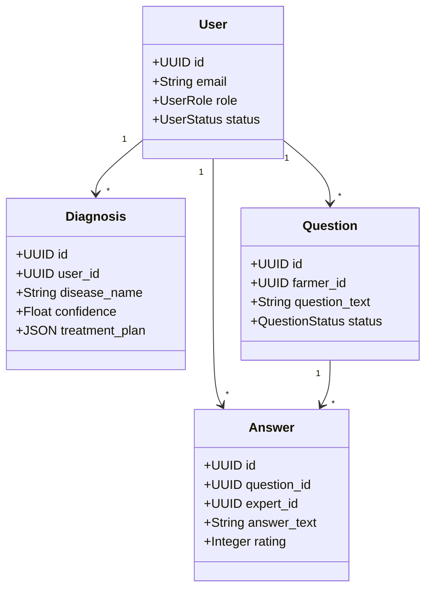
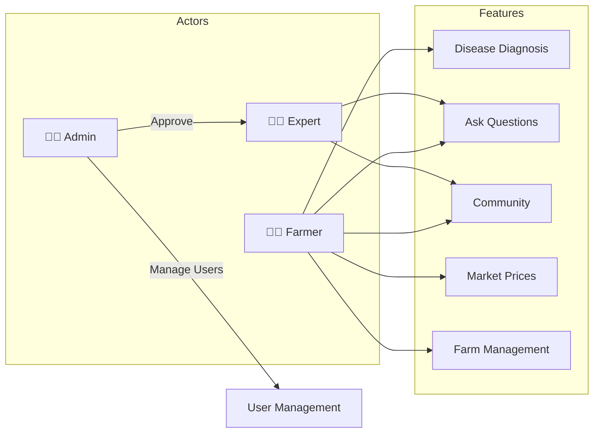

# System Architecture

## Overview
AI-powered crop disease diagnosis platform for farmers with expert consultation.

## Architecture
```
┌─────────────────────────────────────────────┐
│              FRONTEND                       │
│  Flutter App (Mobile)  │  Next.js (Admin)   │
└─────────────────────────────────────────────┘
                    │ REST API
                    ▼
┌─────────────────────────────────────────────┐
│           BACKEND (FastAPI)                 │
│  Auth │ Routes │ Services │ AI/ML          │
└─────────────────────────────────────────────┘
                    │
                    ▼
┌─────────────────────────────────────────────┐
│              DATA LAYER                     │
│     PostgreSQL      │    File Storage       │
└─────────────────────────────────────────────┘
```

## Core Models



## User Roles


