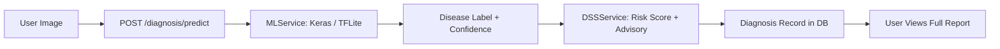
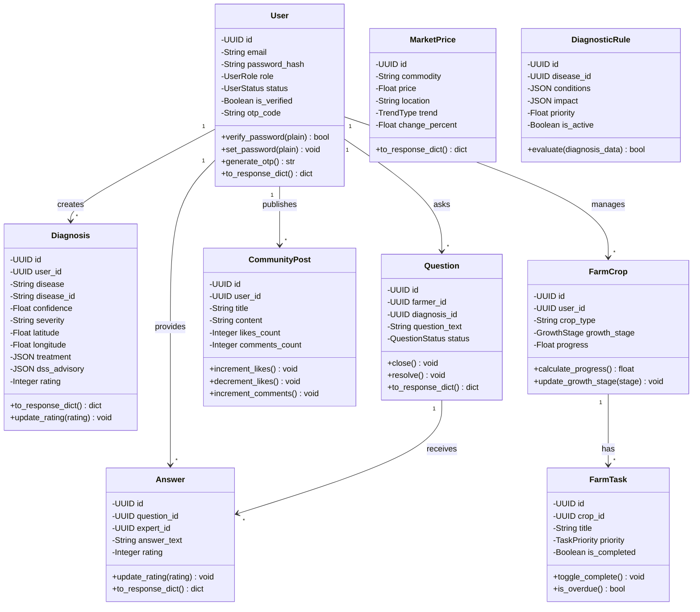
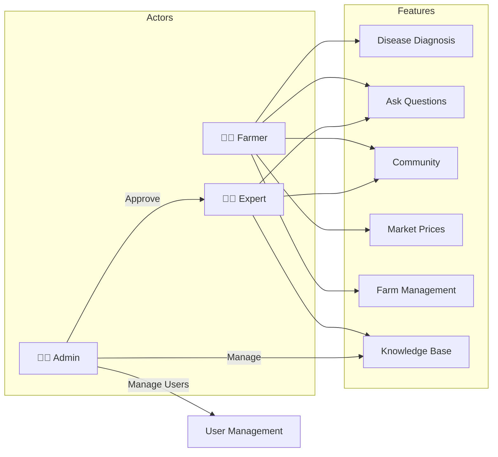

# System Architecture

## Overview
AI-powered crop disease diagnosis platform for farmers with expert consultation, featuring server-side Keras/TFLite inference, a CSV-based Decision Support System (DSS), disease outbreak mapping, pest encyclopedia, and real-time market prices via Agmarknet.

## High-Level Architecture
```
┌─────────────────────────────────────────────┐
│              FRONTEND                       │
│  Flutter App (Mobile)  │  Next.js (Admin)   │
└─────────────────────────────────────────────┘
                    │ REST API
                    ▼
┌─────────────────────────────────────────────┐
│           BACKEND (FastAPI)                 │
│  Auth │ Routes │ Services │ Agronomy       │
│  Rate Limiting (slowapi 60 req/min)        │
└─────────────────────────────────────────────┘
                    │
       ┌────────────┼────────────┐
       ▼            ▼            ▼
┌──────────────┐ ┌──────────┐ ┌─────────────────┐
│ ML / DSS     │ │  REDIS   │ │   DATA LAYER    │
│ • Keras /    │ │  Cache   │ │  PostgreSQL     │
│   TFLite     │ │  Port    │ │  File Storage   │
│   (server)   │ │  6379    │ │  (Cloudinary /  │
│ • DSS Engine │ │          │ │   local)        │
│   (CSV-based)│ │          │ │                 │
└──────────────┘ └──────────┘ └─────────────────┘
                    │
                    ▼
           ┌──────────────────┐
           │ Agmarknet API    │
           │ (OGD Platform)   │
           │ Real-time market │
           │ prices           │
           └──────────────────┘
```

## ML Model Architecture

The system uses **server-side Keras/TFLite inference** — the Flutter mobile app uploads the image to the backend, which runs the ML model and returns the full diagnosis. The backend also hosts a **DSS (Decision Support System)** for actionable advisories.

### 1. Server-Side Disease Classification (Keras / TFLite)
- **Primary model**: `Disease_Classification_v2.keras` (full Keras model, preferred)
- **Fallback**: `Disease_Classification_v2_compressed.tflite` (TFLite, used if Keras unavailable)
- **Runtime**: FastAPI backend with TensorFlow installed
- **Input**: Crop leaf/plant images uploaded via `POST /diagnosis/predict` (224×224 RGB)
- **Output**: Disease label (e.g., `apple_apple_scab`) + confidence score
- **Classes**: 19 crops, 38+ disease categories including healthy states
- **Web fallback**: Flutter Web cannot run TFLite in a browser — uses local label simulation

### 2. Backend DSS Advisory Engine
- **Location**: `backend/app/services/dss_service.py`
- **Data**: CSV tables (`crop_table.csv`, `disease_table.csv`, `advisory_table.csv`)
- **Input**: Disease label from server ML model + weather data + farmer contextual inputs
- **Processing**:
  - Parses label → crop name + disease name
  - Detects current Indian agricultural season (Kharif / Rabi / Zaid)
  - Computes weighted risk score from temperature, humidity, irrigation status, etc.
  - Looks up treatment options and cultural practices from advisory CSV
- **Output**: `{risk_score, risk_level, risk_justification, treatment_options, irrigation_advice, crop_rotation_advice}`



### 3. Agronomy Intelligence Layer
Supplements the DSS with database-driven expert knowledge:
- **Diagnostic Rules**: Context-aware validation of disease predictions
- **Treatment Constraints**: Safety checks (weather, growth stage restrictions)
- **Seasonal Patterns**: Regional disease prevalence data

## Core Models



## User Roles



## Agronomy Intelligence Layer

The platform includes an intelligent agronomy system that enhances ML predictions:

- **Diagnostic Rules**: Context-aware validation of disease predictions
- **Treatment Constraints**: Safety checks for treatment recommendations
- **Seasonal Patterns**: Regional disease prevalence data
- **Expert Knowledge**: Community-driven agronomy database

## New Features (v1.1+)

| Feature | Description |
|---------|-------------|
| 🗺️ Disease Outbreak Map | Public `GET /diagnosis/disease-map` endpoint returns geo-tagged reports for an interactive map |
| 🧠 DSS Advisory Engine | CSV-based decision support system; computes risk score + treatment + cultural advice |
| 🧠 Server-Side ML | Image uploaded to backend; Keras (primary) or TFLite (fallback) runs inference server-side |
| 🐛 Pest Encyclopedia | New `PestInfo` model + `/encyclopedia/pests` endpoints with appearance, life cycle, and control methods |
| 🌐 Agmarknet Integration | Real-time market prices via OGD Platform API, with Redis + in-memory fallback and rate-limit backoff |
| ⚡ Redis Caching | Admin dashboard (5 min), encyclopedia (24 h), market prices (1 h), daily metrics (1 min) |
| 🚦 Rate Limiting | SlowAPI middleware — 60 req/min per IP, returns HTTP 429 on exceed |
| 📍 GPS Geolocation | `latitude` / `longitude` stored on `Diagnosis`; supports disease map pins |
| 💾 DSS Advisory Snapshot | `dss_advisory` JSON column on `Diagnosis` stores advisory at diagnosis time |
