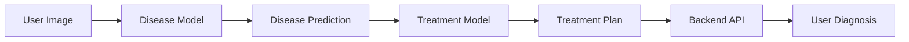
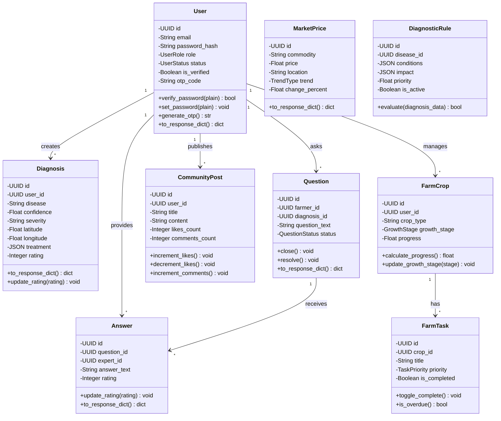
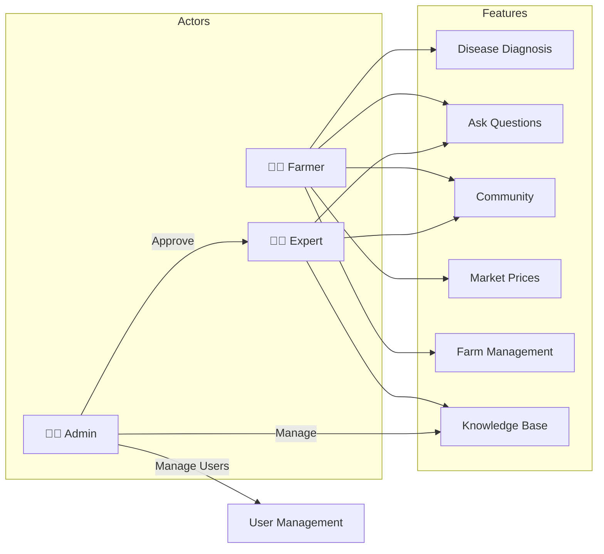

# System Architecture

## Overview
AI-powered crop disease diagnosis platform for farmers with expert consultation, featuring dual ML models for disease classification and treatment recommendation.

## High-Level Architecture
```
┌─────────────────────────────────────────────┐
│              FRONTEND                       │
│  Flutter App (Mobile)  │  Next.js (Admin)   │
└─────────────────────────────────────────────┘
                    │ REST API
                    ▼
┌─────────────────────────────────────────────┐
│           BACKEND (FastAPI)                 │
│  Auth │ Routes │ Services │ Agronomy       │
└─────────────────────────────────────────────┘
                    │
       ┌────────────┼────────────┐
       ▼            ▼            ▼
┌──────────────┐ ┌──────────┐ ┌─────────────────┐
│ ML MODELS    │ │  REDIS   │ │   DATA LAYER    │
│ • Disease    │ │  Cache   │ │  PostgreSQL     │
│ • Treatment  │ │  Port    │ │  File Storage   │
└──────────────┘ │  6379    │ └─────────────────┘
                 └──────────┘
```

## ML Model Architecture

The system employs two specialized TensorFlow Lite models:

### 1. Disease Classification Model
- **Input**: Crop leaf/plant images (224x224 RGB)
- **Output**: Disease predictions with confidence scores
- **Model**: MobileNetV2-based CNN, TFLite format
- **Accuracy**: ~92% on test dataset

### 2. Treatment Recommendation Model  
- **Input**: Disease name, crop type, severity, environmental context
- **Output**: Ranked chemical and organic treatment options
- **Model**: Ensemble model (Random Forest + BERT), TFLite format
- **Integration**: Provides personalized treatment plans based on diagnosis



## Core Models



## User Roles



## Agronomy Intelligence Layer

The platform includes an intelligent agronomy system that enhances ML predictions:

- **Diagnostic Rules**: Context-aware validation of disease predictions
- **Treatment Constraints**: Safety checks for treatment recommendations
- **Seasonal Patterns**: Regional disease prevalence data
- **Expert Knowledge**: Community-driven agronomy database
