# Database Schema Documentation

## Entity Relationship Diagram

```mermaid
erDiagram
    %% ==================== USER MANAGEMENT ====================
    users {
        uuid id PK
        varchar email UK
        varchar password_hash
        varchar full_name
        varchar phone
        enum role "FARMER|EXPERT|ADMIN"
        enum status "PENDING|ACTIVE|SUSPENDED"
        boolean is_verified
        varchar otp_code
        timestamp otp_created_at
        varchar expertise_domain
        text qualification
        int experience_years
        varchar location
        timestamp created_at
        timestamp updated_at
    }

    %% ==================== DIAGNOSIS ====================
    diagnoses {
        uuid id PK
        uuid user_id FK
        varchar media_path
        varchar media_type
        varchar crop_type
        varchar location
        varchar disease
        varchar severity
        float confidence
        json treatment
        text prevention
        text warnings
        int rating
        json additional_diseases
        timestamp created_at
    }

    %% ==================== Q&A SYSTEM ====================
    questions {
        uuid id PK
        uuid farmer_id FK
        uuid diagnosis_id FK
        text question_text
        varchar media_path
        enum status "OPEN|RESOLVED|CLOSED"
        timestamp created_at
        timestamp updated_at
    }

    answers {
        uuid id PK
        uuid question_id FK
        uuid expert_id FK
        text answer_text
        int rating
        timestamp created_at
    }

    %% ==================== COMMUNITY ====================
    community_posts {
        uuid id PK
        uuid user_id FK
        varchar title
        text content
        varchar image_path
        varchar category
        boolean is_expert_post
        int likes_count
        int comments_count
        boolean is_pinned
        timestamp created_at
        timestamp updated_at
    }

    community_comments {
        uuid id PK
        uuid post_id FK
        uuid user_id FK
        text content
        timestamp created_at
    }

    post_likes {
        uuid id PK
        uuid post_id FK
        uuid user_id FK
        timestamp created_at
    }

    %% ==================== FARM MANAGEMENT ====================
    farm_crops {
        uuid id PK
        uuid user_id FK
        varchar name
        varchar crop_type
        varchar field_name
        float area_size
        varchar area_unit
        date sow_date
        date expected_harvest_date
        enum growth_stage
        float progress
        text notes
        boolean is_active
        timestamp created_at
        timestamp updated_at
    }

    farm_tasks {
        uuid id PK
        uuid user_id FK
        uuid crop_id FK
        varchar title
        text description
        timestamp due_date
        enum priority "LOW|MEDIUM|HIGH"
        boolean is_completed
        timestamp completed_at
        boolean is_recurring
        int recurrence_days
        timestamp created_at
        timestamp updated_at
    }

    %% ==================== MARKET ====================
    market_prices {
        uuid id PK
        varchar commodity
        float price
        varchar unit
        varchar location
        enum trend "UP|DOWN|STABLE"
        float change_percent
        float min_price
        float max_price
        float arrival_qty
        timestamp recorded_at
        timestamp created_at
        timestamp updated_at
    }

    %% ==================== ENCYCLOPEDIA ====================
    crop_encyclopedia {
        uuid id PK
        varchar name UK
        varchar scientific_name
        text description
        varchar season
        float temp_min
        float temp_max
        varchar water_requirement
        varchar soil_type
        jsonb growing_tips
        jsonb nutritional_info
        jsonb common_varieties
        jsonb common_diseases
        varchar image_url
        timestamp created_at
        timestamp updated_at
    }

    disease_encyclopedia {
        uuid id PK
        varchar name
        varchar scientific_name
        jsonb affected_crops
        text description
        jsonb symptoms
        text causes
        jsonb chemical_treatment
        jsonb organic_treatment
        jsonb prevention
        varchar severity_level
        varchar spread_method
        jsonb safety_warnings
        jsonb environmental_warnings
        varchar image_url
        timestamp created_at
        timestamp updated_at
    }

    %% ==================== AGRONOMY INTELLIGENCE ====================
    agronomy_diagnostic_rules {
        uuid id PK
        uuid disease_id FK
        varchar rule_name
        text description
        jsonb conditions
        jsonb impact
        float priority
        boolean is_active
        timestamp created_at
        timestamp updated_at
    }

    agronomy_treatment_constraints {
        uuid id PK
        varchar treatment_name
        varchar treatment_type
        text constraint_description
        jsonb restricted_conditions
        varchar enforcement_level
        varchar risk_level
        timestamp created_at
        timestamp updated_at
    }

    agronomy_seasonal_patterns {
        uuid id PK
        uuid disease_id FK
        uuid crop_id FK
        varchar region
        varchar season
        float likelihood_score
        timestamp created_at
        timestamp updated_at
    }

    %% ==================== SYSTEM MONITORING ====================
    system_logs {
        uuid id PK
        varchar level
        text message
        varchar source
        uuid user_id FK
        json log_metadata
        timestamp created_at
    }

    system_metrics {
        uuid id PK
        varchar metric_name
        float metric_value
        varchar metric_type
        json tags
        timestamp recorded_at
    }

    daily_stats {
        uuid id PK
        date date UK
        int total_diagnoses
        int total_questions
        int total_answers
        int new_users
        int active_users
        float avg_confidence
        int error_count
    }

    %% ==================== RELATIONSHIPS ====================
    users ||--o{ diagnoses : "creates"
    users ||--o{ questions : "asks"
    users ||--o{ answers : "provides"
    users ||--o{ community_posts : "publishes"
    users ||--o{ community_comments : "writes"
    users ||--o{ post_likes : "gives"
    users ||--o{ farm_crops : "manages"
    users ||--o{ farm_tasks : "owns"
    users ||--o{ system_logs : "triggers"

    questions }o--|| diagnoses : "references"
    questions ||--o{ answers : "receives"

    community_posts ||--o{ community_comments : "contains"
    community_posts ||--o{ post_likes : "receives"

    farm_crops ||--o{ farm_tasks : "has"

    crop_encyclopedia ||--o{ agronomy_seasonal_patterns : "applies_to"

    disease_encyclopedia ||--o{ agronomy_diagnostic_rules : "has_rules"
    disease_encyclopedia ||--o{ agronomy_seasonal_patterns : "has_patterns"
```



---

## Table Descriptions

### User Management

| Table | Description |
|-------|-------------|
| `users` | All user accounts (farmers, experts, admins) with role-based access |

### Core Tables

| Table | Description |
|-------|-------------|
| `diagnoses` | Disease prediction results from ML model with treatment plans |
| `questions` | Farmer questions to experts, can reference a diagnosis |
| `answers` | Expert responses to questions with optional rating |

### Community Tables

| Table | Description |
|-------|-------------|
| `community_posts` | Forum posts with categories (general, tip, article, question) |
| `community_comments` | Comments on posts |
| `post_likes` | Like records (unique per user-post) |

### Farm Management Tables

| Table | Description |
|-------|-------------|
| `farm_crops` | Farmer's registered crops with growth tracking |
| `farm_tasks` | Scheduled tasks with priority, recurrence support |

### Reference Data Tables

| Table | Description |
|-------|-------------|
| `crop_encyclopedia` | Comprehensive crop information catalog |
| `disease_encyclopedia` | Disease info with symptoms, treatments, warnings |
| `market_prices` | Market price data by commodity and mandi location |

### Agronomy Intelligence Tables

| Table | Description |
|-------|-------------|
| `agronomy_diagnostic_rules` | Context-based rules for disease diagnosis validation |
| `agronomy_treatment_constraints` | Safety constraints for treatments |
| `agronomy_seasonal_patterns` | Disease prevalence by season/region |

### System Tables

| Table | Description |
|-------|-------------|
| `system_logs` | Application logs for monitoring |
| `system_metrics` | Performance metrics (gauges, counts) |
| `daily_stats` | Aggregated daily statistics |

---

## Key Indexes

```sql
-- Users
CREATE INDEX idx_users_email ON users(email);
CREATE INDEX idx_users_role ON users(role);

-- Diagnoses
CREATE INDEX idx_diagnoses_user_id ON diagnoses(user_id);
CREATE INDEX idx_diagnoses_created_at ON diagnoses(created_at);

-- Questions
CREATE INDEX idx_questions_farmer_id ON questions(farmer_id);
CREATE INDEX idx_questions_status ON questions(status);
CREATE INDEX idx_questions_created_at ON questions(created_at);

-- Answers
CREATE INDEX idx_answers_question_id ON answers(question_id);
CREATE INDEX idx_answers_expert_id ON answers(expert_id);

-- Community
CREATE INDEX idx_posts_user_id ON community_posts(user_id);
CREATE INDEX idx_comments_post_id ON community_comments(post_id);
CREATE INDEX idx_likes_post_id ON post_likes(post_id);
CREATE INDEX idx_likes_user_id ON post_likes(user_id);

-- Farm
CREATE INDEX idx_farm_crops_user_id ON farm_crops(user_id);
CREATE INDEX idx_farm_tasks_user_id ON farm_tasks(user_id);
CREATE INDEX idx_farm_tasks_crop_id ON farm_tasks(crop_id);

-- Market
CREATE INDEX idx_market_commodity ON market_prices(commodity);
CREATE INDEX idx_market_location ON market_prices(location);

-- Encyclopedia
CREATE UNIQUE INDEX idx_crop_name ON crop_encyclopedia(name);
CREATE INDEX idx_disease_name ON disease_encyclopedia(name);

-- Agronomy
CREATE INDEX idx_diagnostic_rules_disease ON agronomy_diagnostic_rules(disease_id);
CREATE INDEX idx_seasonal_patterns_disease ON agronomy_seasonal_patterns(disease_id);
CREATE INDEX idx_seasonal_patterns_crop ON agronomy_seasonal_patterns(crop_id);

-- System
CREATE INDEX idx_system_logs_level ON system_logs(level);
CREATE INDEX idx_system_logs_source ON system_logs(source);
CREATE INDEX idx_system_logs_created_at ON system_logs(created_at);
CREATE INDEX idx_daily_stats_date ON daily_stats(date);
```

---

## Enumerations

| Enum | Values | Used In |
|------|--------|---------|
| `UserRole` | FARMER, EXPERT, ADMIN | users.role |
| `UserStatus` | PENDING, ACTIVE, SUSPENDED | users.status |
| `QuestionStatus` | OPEN, RESOLVED, CLOSED | questions.status |
| `GrowthStage` | germination, seedling, vegetative, flowering, fruiting, ripening, harvest | farm_crops.growth_stage |
| `TaskPriority` | low, medium, high | farm_tasks.priority |
| `TrendType` | up, down, stable | market_prices.trend |

---

## Migration Strategy

The application uses **Alembic** for database migrations:

```bash
# Generate a new migration
alembic revision --autogenerate -m "description"

# Apply migrations
alembic upgrade head

# Rollback one version
alembic downgrade -1

# View migration history
alembic history
```

All migrations are stored in `backend/alembic/versions/`.
