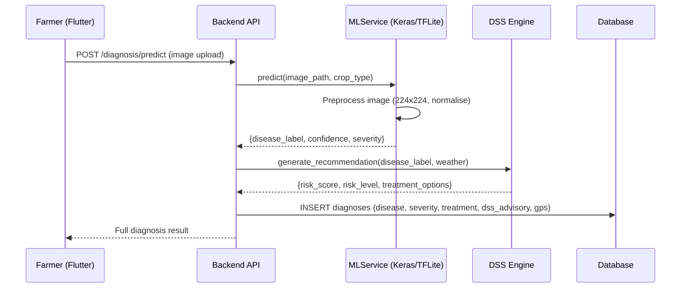

# Machine Learning (ML) Documentation

## Overview

The AI Crop Disease Diagnosis System uses **server-side Keras/TFLite inference** combined with a **backend Decision Support System (DSS)** to provide comprehensive plant disease diagnosis and actionable treatment advisories.

The mobile app uploads the image to the server; the backend runs the Keras model (falling back to TFLite if needed) and returns the full diagnosis + treatment. The web app uses a local label simulation (TFLite cannot run in a browser) before calling the DSS.

| Component | Where it runs | Purpose |
|-----------|--------------|--------|
| Disease Classification (Keras / TFLite) | FastAPI backend (server) | Detect disease from uploaded image |
| DSS Advisory Engine (CSV-based) | FastAPI backend | Risk scoring + treatment advice |
| Agronomy Intelligence | FastAPI backend (PostgreSQL) | Context validation + safety checks |
| Web simulation | Flutter Web (browser) | Label simulation when TFLite unavailable |

---

## Model Architecture

### 1. Disease Classification Model (Server-Side)

**Purpose**: Detect plant diseases from leaf/plant images with high accuracy, running on the FastAPI server.

#### Technical Specifications
- **Primary framework**: Keras (TensorFlow 2.x) — preferred when available
- **Fallback framework**: TFLite (`Disease_Classification_v2_compressed.tflite`)
- **Model files** (searched in order): `Disease_Classification_v2.keras` → `Disease_Classification_v1.keras` → TFLite
- **Base Architecture**: MobileNetV2-based CNN
- **Input**: 224×224 RGB images
- **Output**: Disease label (e.g., `apple_apple_scab`) + confidence score
- **Accuracy**: ~92% on validation dataset
- **Classes**: 38+ disease/healthy states across 19 crops
- **Inference trigger**: `POST /diagnosis/predict` — Flutter mobile uploads the image; backend runs the model server-side

#### Supported Crops & Diseases
| Crop | Example Diseases |
|------|-----------------|
| Apple | Apple Scab, Black Rot, Cedar Rust |
| Bean | Angular Leaf Spot, Rust |
| Bell Pepper | Bacterial Spot |
| Cherry | Powdery Mildew |
| Corn | Northern Leaf Blight, Gray Leaf Spot, Common Rust |
| Cotton | Bacterial Blight, Leaf Curl |
| Cucumber | Anthracnose, Downy Mildew |
| Grape | Black Rot, Esca, Leaf Blight |
| Groundnut | Early Leaf Spot, Rust |
| Guava | Fruit Canker, Wilt |
| Lemon | Citrus Canker, Greening |
| Peach | Bacterial Spot |
| Potato | Early Blight, Late Blight |
| Pumpkin | Powdery Mildew, Downy Mildew |
| Rice | Bacterial Blight, Blast, Brown Spot |
| Strawberry | Leaf Scorch |
| Sugarcane | Red Rot, Smut |
| Tomato | Early Blight, Late Blight, Leaf Mold, Septoria Spot, etc. |
| Wheat | Leaf Rust, Powdery Mildew, Yellow Rust |

#### Label Format
Labels follow the pattern: `<crop>_<disease_name>` (e.g., `tomato_early_blight`, `apple_apple_scab`).
Special cases:
- `healthy_<crop>` → plant is healthy
- `diseased_<crop>` → generic disease detected

Labels are stored in `ml_models/labels.txt` and loaded by `MLService` at startup.

---

### 2. DSS Advisory Engine (Backend)

**Purpose**: Convert a disease label into a risk-scored, actionable advisory using agronomic rules.

#### Location
`backend/app/services/dss_service.py` + `backend/app/services/dss_data/*.csv`

#### Data Sources
| File | Contents |
|------|----------|
| `crop_table.csv` | Crop IDs and names |
| `disease_table.csv` | Disease types per crop (Fungal / Bacterial / Viral / Pest) |
| `advisory_table.csv` | Treatment options, irrigation + rotation advice per disease type |

#### Processing Pipeline
```python
DSSService.generate_recommendation(disease_label, weather, farmer_answers)
# 1. parse_label(disease_label)         → (crop_name, disease_name)
# 2. get_current_season()               → "Kharif" | "Rabi" | "Zaid"
# 3. get_disease_type(crop, disease)    → e.g., "Fungal"
# 4. compute_risk(disease_type, weather, farmer_answers) → (score, level, justification)
# 5. _get_advisory_row(disease_type)   → treatment + cultural advice
# Returns: {risk_score, risk_level, treatment_options, irrigation_advice, crop_rotation_advice}
```

#### Risk Factors
| Input | Weight |
|-------|--------|
| Temperature (optimal for disease) | High |
| Humidity (>70% boosts fungal risk) | High |
| Waterlogged conditions | Medium |
| Recent fertilizer application | Medium |
| First growth cycle | Low |

#### Output Schema
```json
{
  "crop": "apple",
  "disease": "apple_scab",
  "season": "Rabi",
  "disease_type": "Fungal",
  "risk_score": 7.5,
  "risk_level": "High",
  "risk_justification": "High humidity increases fungal spread risk.",
  "treatment_options": ["Mancozeb 75% WP", "Captan 50% WP"],
  "irrigation_advice": "Avoid overhead irrigation.",
  "crop_rotation_advice": "Rotate with non-host crops for 1-2 seasons."
}
```

---

#### Technical Specifications
- **Framework**: TensorFlow Lite (TFLite)
- **Architecture**: Ensemble model (Random Forest + BERT embeddings)
- **Input Features**:
  - Disease name (text embedding)
  - Crop type
  - Severity level
  - Temperature, humidity, season
  - Soil conditions
  - Farm location/region
- **Output**: Ranked list of treatments (chemical + organic)
- **Integration**: Automatically triggered after disease classification

#### Implementation
The treatment model integrates seamlessly with the diagnosis workflow:

```python
# After disease detection
disease_result = ml_service.predict(image, crop_type)

# Treatment model automatically generates plan
treatment_plan = treatment_service.get_recommendations(
    disease=disease_result.disease,
    crop=crop_type,
    severity=disease_result.severity,
    context=environmental_data
)
```

#### Treatment Categories
1. **Chemical Treatments**
   - Fungicides, bactericides, insecticides
   - Application timing and dosage
   - Weather considerations
   
2. **Organic Alternatives**
   - Bio-pesticides, natural remedies
   - Cultural practices
   - Preventive measures

---

## Agronomy Intelligence Integration

The platform includes an **Agronomy Intelligence Layer** that enhances both ML models:

### Diagnostic Rules
Context-aware validation of disease predictions:
- Temperature/humidity checks
- Seasonal likelihood adjustments
- Regional disease prevalence

### Treatment Constraints
Safety validation for treatment recommendations:
- Weather restrictions (e.g., no spraying during rain)
- Growth stage limitations
- Residue management rules

### Seasonal Patterns
Historical disease data to improve predictions:
- Region-specific disease calendars
- Crop-disease associations
- Climate-based risk factors

---

## End-to-End ML Workflow



## Data Models

### Server-Side Prediction Output

| Field | Type | Description |
|-------|------|-------------|
| `disease_label` | `str` | Raw label e.g. `apple_apple_scab` |
| `confidence` | `float` | Probability (0.0 – 1.0) |
| `severity` | `str` | mild / moderate / severe |
| `additional_predictions` | `List[Dict]` | Top-3 alternative predictions |

### DSS Advisory (Backend Output)

| Field | Type | Description |
|-------|------|-------------|
| `crop` | `str` | Parsed crop name |
| `disease` | `str` | Parsed disease name |
| `season` | `str` | Kharif / Rabi / Zaid |
| `disease_type` | `str` | Fungal / Bacterial / Viral / Pest |
| `risk_score` | `float` | 0–10 composite risk score |
| `risk_level` | `str` | Low / Moderate / High / Critical |
| `risk_justification` | `str` | Human-readable explanation |
| `treatment_options` | `List[str]` | Recommended treatments |
| `irrigation_advice` | `str` | Irrigation guidance |
| `crop_rotation_advice` | `str` | Rotation recommendation |

---

## Agronomy Intelligence Integration

The platform includes an **Agronomy Intelligence Layer** (database-driven) that supplements the DSS:

### Diagnostic Rules
Context-aware validation stored in `agronomy_diagnostic_rules` table:
- Temperature/humidity threshold checks
- Seasonal likelihood adjustments
- Regional disease prevalence validation

### Treatment Constraints
Safety validation stored in `agronomy_treatment_constraints` table:
- Weather restrictions (e.g., no spraying during rain)
- Growth stage limitations
- Residue management rules

### Seasonal Patterns
Historical disease data in `agronomy_seasonal_patterns` table:
- Region-specific disease calendars
- Crop-disease associations per season
- Climate-based risk factors

---

## Error Handling

| Scenario | Behaviour |
|----------|-----------|
| Unknown disease label in DSS | `ValueError` → HTTP 500 with detail |
| Missing `disease_label` in request | HTTP 400 Bad Request |
| Low TFLite confidence | Warning included in advisory |
| DSS CSV file not found | Service fails to initialise at startup |

---

## Scalability & Future Enhancements

### Immediate Roadmap
- Expand DSS CSV data to cover all 38+ disease categories
- Add server-side TFLite inference fallback
- GPU acceleration for batch inference

### Advanced Features
- Multi-disease detection in single image
- Disease progression tracking
- Auto crop-type detection from image
- Real-time localization (bounding boxes)
- Integration with weather APIs for dynamic treatment timing

### Infrastructure Options
- Cloud inference APIs (AWS SageMaker, Google AI Platform)
- Containerized GPU services (NVIDIA Triton)
- Edge deployment (on-device inference for offline usage)

---

## Why Dual ML Models?

**Disease Classification** alone tells farmers *what's wrong*.  
**Treatment Recommendation** tells them *how to fix it*.

This two-model approach provides:
- **Actionable insights** instead of just diagnoses
- **Personalized recommendations** based on context
- **Both conventional and organic options** for different farmer preferences
- **Higher farmer satisfaction** and platform value
