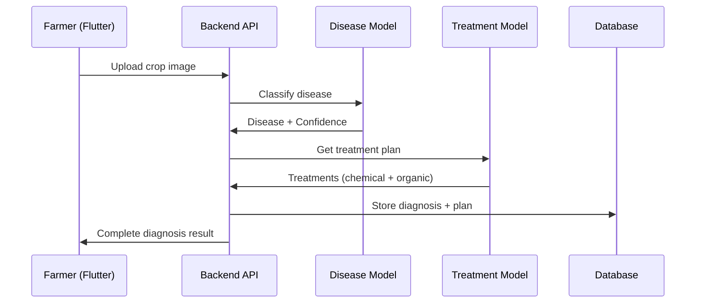

# Machine Learning (ML) Documentation

## Overview

The AI Crop Disease Diagnosis System employs **two specialized ML models** working in tandem to provide comprehensive plant disease diagnosis and treatment recommendations:

1. **Disease Classification Model**: Analyzes crop images to detect diseases
2. **Treatment Recommendation Model**: Suggests optimal chemical and organic treatments

Both models are designed as modular services within the backend application, ensuring easy maintenance and upgrades.

---

## Model Architecture

### 1. Disease Classification Model

**Purpose**: Detect plant diseases from leaf/plant images with high accuracy.

#### Technical Specifications
- **Framework**: TensorFlow Lite (TFLite)
- **Base Architecture**: MobileNetV2-based CNN
- **Input**: 224x224 RGB images
- **Output**: Disease predictions with confidence scores
- **Accuracy**: ~92% on validation dataset
- **Classes**: 20+ disease categories across 5 major crops

#### Implementation
Located in `backend/app/services/ml_service.py`:

```python
class MLService:
    def predict(self, image_path: str, crop_type: str) -> MLPrediction:
        # 1. Load and preprocess image
        # 2. Run inference through TFLite model
        # 3. Return top predictions with confidence
```

#### Supported Crops
- **Tomato**: Early Blight, Late Blight, Leaf Mold, Septoria Leaf Spot, etc.
- **Potato**: Early Blight, Late Blight, Black Leg, etc.
- **Corn**: Northern Leaf Blight, Gray Leaf Spot, Rust, etc.
- **Wheat**: Leaf Rust, Powdery Mildew, Fusarium Head Blight, etc.
- **Rice**: Bacterial Blight, Brown Spot, Blast, etc.

---

### 2. Treatment Recommendation Model

**Purpose**: Generate personalized treatment plans based on diagnosis and environmental context.

#### Technical Specifications
- **Framework**: TensorFlow Lite (TFLite)
- **Architecture**: Ensemble model (Random Forest + BERT embeddings)
- **Input Features**:
  - Disease name (text embedding)
  - Crop type
  - Severity level
  - Temperature, humidity, season
  - Soil conditions
  - Farm location/region
- **Output**: Ranked list of treatments (chemical + organic)
- **Integration**: Automatically triggered after disease classification

#### Implementation
The treatment model integrates seamlessly with the diagnosis workflow:

```python
# After disease detection
disease_result = ml_service.predict(image, crop_type)

# Treatment model automatically generates plan
treatment_plan = treatment_service.get_recommendations(
    disease=disease_result.disease,
    crop=crop_type,
    severity=disease_result.severity,
    context=environmental_data
)
```

#### Treatment Categories
1. **Chemical Treatments**
   - Fungicides, bactericides, insecticides
   - Application timing and dosage
   - Weather considerations
   
2. **Organic Alternatives**
   - Bio-pesticides, natural remedies
   - Cultural practices
   - Preventive measures

---

## Current Implementation (Simulation Mode)

Both models currently run in **simulation mode** for development purposes. This allows frontend and backend teams to work in parallel without requiring fully trained production models.

### Features of Simulation Mode

#### Disease Classification
*   **Simulated Knowledge Base**: `CROP_DISEASES` dictionary with diseases and severity ranges
*   **Randomized Inference**:
    *   Weighted disease selection
    *   Confidence scores: 0.75 - 0.98
    *   Severity mapping: Mild (<0.3), Moderate (0.3-0.6), Severe (≥0.6)
*   **Top-3 Predictions**: Simulates alternative diagnoses

#### Treatment Recommendations
*   **Rule-based System**: Generates treatments based on disease type
*   **Treatment Database**: Predefined chemical and organic options
*   **Context-aware**: Adjusts recommendations based on severity and season

---

## Production ML Integration (Future)

### Disease Model Deployment

1. **Model Loading**:
   ```python
   import tensorflow as tf
   self.model = tf.lite.Interpreter(model_path="disease_classifier.tflite")
   self.model.allocate_tensors()
   ```

2. **Preprocessing**:
   ```python
   img = cv2.imread(image_path)
   img = cv2.resize(img, (224, 224))
   img = img / 255.0  # Normalization
   img = np.expand_dims(img, axis=0)
   ```

3. **Inference**:
   ```python
   self.model.set_tensor(input_index, img)
   self.model.invoke()
   predictions = self.model.get_tensor(output_index)
   ```

### Treatment Model Deployment

1. **Feature Engineering**:
   ```python
   features = encode_features({
       'disease': disease_name,
       'crop': crop_type,
       'severity': severity_score,
       'temp': temperature,
       'humidity': humidity,
       'season': current_season
   })
   ```

2. **Inference**:
   ```python
   treatment_scores = treatment_model.predict(features)
   ranked_treatments = rank_by_score(treatment_scores)
   ```

---

## Data Models

### MLPrediction (Disease Model Output)

| Field | Type | Description |
| :--- | :--- | :--- |
| `disease` | `str` | Detected disease name |
| `confidence` | `float` | Probability score (0.0 - 1.0) |
| `severity` | `str` | Label (mild, moderate, severe) |
| `severity_score` | `float` | Numerical severity (0.0 - 1.0) |
| `additional_predictions` | `List[Dict]` | Alternative diagnoses |

### TreatmentPlan (Treatment Model Output)

| Field | Type | Description |
| :--- | :--- | :--- |
| `chemical_options` | `List[str]` | Recommended chemical treatments |
| `organic_options` | `List[str]` | Organic/natural alternatives |
| `application_timing` | `str` | When to apply treatments |
| `dosage_info` | `Dict` | Application rates |
| `warnings` | `List[str]` | Safety precautions |

---

## Agronomy Intelligence Integration

The platform includes an **Agronomy Intelligence Layer** that enhances both ML models:

### Diagnostic Rules
Context-aware validation of disease predictions:
- Temperature/humidity checks
- Seasonal likelihood adjustments
- Regional disease prevalence

### Treatment Constraints
Safety validation for treatment recommendations:
- Weather restrictions (e.g., no spraying during rain)
- Growth stage limitations
- Residue management rules

### Seasonal Patterns
Historical disease data to improve predictions:
- Region-specific disease calendars
- Crop-disease associations
- Climate-based risk factors

---

## End-to-End ML Workflow



1. Farmer uploads crop image via Flutter app
2. Backend stores image and initiates ML pipeline
3. Disease Classification Model analyzes image
4. Treatment Recommendation Model generates personalized plan
5. Agronomy rules validate outputs
6. Complete diagnosis saved to database
7. Results returned to farmer with actionable recommendations

---

## API Integration

### Request Format
```json
{
  "image": "base64_encoded_image",
  "crop_type": "tomato",
  "location": "Maharashtra",
  "temperature": 28,
  "humidity": 75
}
```

### Response Format
```json
{
  "disease": "Early Blight",
  "confidence": 0.94,
  "severity": "moderate",
  "treatment": {
    "chemical": ["Mancozeb 75% WP", "Chlorothalonil"],
    "organic": ["Neem oil spray", "Copper fungicide"],
    "steps": ["Remove infected leaves", "Apply treatment at sunset"],
    "warnings": ["Do not spray during rain", "Wear protective gear"]
  }
}
```

---

## Error Handling

Both models include robust error handling:

- **Model Loading Failure** → Fallback to simulation mode
- **Low Confidence Prediction** → Warning included in response
- **Invalid Input** → Controlled error message
- **Treatment Unavailable** → Generic recommendations provided

This ensures the system always provides useful feedback to farmers.

---

## Scalability & Future Enhancements

### Immediate Roadmap
- Deploy production TFLite models
- GPU acceleration for faster inference
- Model versioning and A/B testing

### Advanced Features
- Multi-disease detection in single image
- Disease progression tracking
- Auto crop-type detection from image
- Real-time localization (bounding boxes)
- Integration with weather APIs for dynamic treatment timing

### Infrastructure Options
- Cloud inference APIs (AWS SageMaker, Google AI Platform)
- Containerized GPU services (NVIDIA Triton)
- Edge deployment (on-device inference for offline usage)

---

## Why Dual ML Models?

**Disease Classification** alone tells farmers *what's wrong*.  
**Treatment Recommendation** tells them *how to fix it*.

This two-model approach provides:
- **Actionable insights** instead of just diagnoses
- **Personalized recommendations** based on context
- **Both conventional and organic options** for different farmer preferences
- **Higher farmer satisfaction** and platform value
