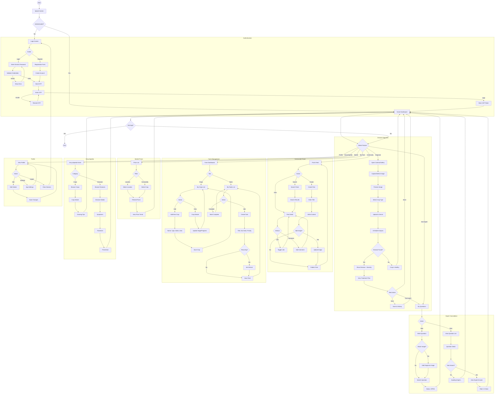

# Activity Diagram

## Main Application Flow

```mermaid
flowchart TD
    START((Start)) --> SPLASH[Splash Screen]
    SPLASH --> AUTH{Authenticated?}
    
    AUTH -->|No| LOGIN_SCREEN[Login Screen]
    AUTH -->|Yes| HOME
    
    %% Authentication Flow
    subgraph AUTH_FLOW[Authentication]
        LOGIN_SCREEN --> AUTH_CHOICE{Action}
        AUTH_CHOICE -->|Login| ENTER_CREDS[Enter Email & Password]
        AUTH_CHOICE -->|Register| REG_FORM[Registration Form]
        
        ENTER_CREDS --> VALIDATE[Validate Credentials]
        VALIDATE -->|Invalid| LOGIN_ERROR[Show Error]
        LOGIN_ERROR --> ENTER_CREDS
        VALIDATE -->|Valid| SEND_OTP[Send OTP]
        
        REG_FORM --> CREATE_USER[Create Account]
        CREATE_USER --> SEND_OTP
        
        SEND_OTP --> VERIFY_OTP[Enter OTP]
        VERIFY_OTP -->|Invalid| RESEND[Resend OTP]
        RESEND --> VERIFY_OTP
        VERIFY_OTP -->|Valid| STORE_TOKEN[Store JWT Token]
        STORE_TOKEN --> HOME
    end
    
    %% Main Navigation
    HOME[Home Dashboard] --> FEATURES{Select Feature}
    
    %% Disease Diagnosis
    subgraph DIAG_FLOW[Disease Diagnosis]
        FEATURES -->|Diagnose| D_START[Open Camera/Gallery]
        D_START --> D_CAPTURE[Capture/Select Image]
        D_CAPTURE --> D_PREVIEW[Preview Image]
        D_PREVIEW --> D_CROP_TYPE[Select Crop Type]
        D_CROP_TYPE --> D_UPLOAD[Upload to Server]
        D_UPLOAD --> D_AI[AI Model Analysis]
        D_AI --> D_RESULT{Disease Found?}
        D_RESULT -->|Yes| D_SHOW[Show Disease + Severity]
        D_RESULT -->|No| D_HEALTHY[Crop is Healthy]
        D_SHOW --> D_TREATMENT[View Treatment Plan]
        D_TREATMENT --> D_ACTIONS{Next Action}
        D_ACTIONS -->|Save| D_SAVE[Save to History]
        D_ACTIONS -->|Ask Expert| Q_START
        D_ACTIONS -->|Done| HOME
        D_HEALTHY --> HOME
        D_SAVE --> HOME
    end
    
    %% Expert Q&A
    subgraph QA_FLOW[Expert Consultation]
        FEATURES -->|Ask Expert| Q_START[My Questions]
        Q_START --> Q_ACTION{Action}
        Q_ACTION -->|New| Q_WRITE[Write Question]
        Q_ACTION -->|View| Q_LIST[View Question List]
        
        Q_WRITE --> Q_ATTACH{Attach Image?}
        Q_ATTACH -->|Yes| Q_IMAGE[Add Diagnosis Image]
        Q_ATTACH -->|No| Q_SUBMIT
        Q_IMAGE --> Q_SUBMIT[Submit Question]
        Q_SUBMIT --> Q_WAITING[Status: OPEN]
        Q_WAITING --> HOME
        
        Q_LIST --> Q_DETAIL[Question Detail]
        Q_DETAIL --> Q_HAS_ANS{Has Answer?}
        Q_HAS_ANS -->|Yes| Q_VIEW_ANS[View Expert Answer]
        Q_HAS_ANS -->|No| Q_PENDING[Awaiting Expert...]
        Q_VIEW_ANS --> Q_RATE[Rate 1-5 Stars]
        Q_RATE --> HOME
        Q_PENDING --> HOME
    end
    
    %% Community Forum
    subgraph COMM_FLOW[Community Forum]
        FEATURES -->|Community| C_FEED[Posts Feed]
        C_FEED --> C_ACTION{Action}
        C_ACTION -->|Create| C_NEW[Create Post]
        C_ACTION -->|View| C_DETAIL[Post Detail]
        C_ACTION -->|Search| C_SEARCH[Search Posts]
        
        C_NEW --> C_TITLE[Enter Title]
        C_TITLE --> C_CONTENT[Write Content]
        C_CONTENT --> C_IMG{Add Image?}
        C_IMG -->|Yes| C_UPLOAD[Upload Image]
        C_IMG -->|No| C_PUBLISH
        C_UPLOAD --> C_PUBLISH[Publish Post]
        C_PUBLISH --> C_FEED
        
        C_DETAIL --> C_INTERACT{Interact}
        C_INTERACT -->|Like| C_LIKE[Toggle Like]
        C_INTERACT -->|Comment| C_COMMENT[Add Comment]
        C_LIKE --> C_DETAIL
        C_COMMENT --> C_DETAIL
        
        C_SEARCH --> C_RESULTS[Search Results]
        C_RESULTS --> C_DETAIL
    end
    
    %% Farm Management
    subgraph FARM_FLOW[Farm Management]
        FEATURES -->|My Farm| F_DASH[Farm Dashboard]
        F_DASH --> F_TAB{Tab}
        F_TAB -->|Crops| F_CROPS[My Crops List]
        F_TAB -->|Tasks| F_TASKS[My Tasks List]
        
        F_CROPS --> F_CROP_ACT{Action}
        F_CROP_ACT -->|Add| F_ADD_CROP[Add New Crop]
        F_CROP_ACT -->|View| F_CROP_DETAIL[Crop Details]
        F_ADD_CROP --> F_CROP_FORM[Name, Type, Dates, Area]
        F_CROP_FORM --> F_SAVE_CROP[Save Crop]
        F_SAVE_CROP --> F_CROPS
        F_CROP_DETAIL --> F_UPDATE[Update Stage/Progress]
        F_UPDATE --> F_CROPS
        
        F_TASKS --> F_TASK_ACT{Action}
        F_TASK_ACT -->|Add| F_ADD_TASK[Create Task]
        F_TASK_ACT -->|Complete| F_COMPLETE[Mark Complete]
        F_ADD_TASK --> F_TASK_FORM[Title, Due Date, Priority]
        F_TASK_FORM --> F_RECURRING{Recurring?}
        F_RECURRING -->|Yes| F_SET_RECUR[Set Interval]
        F_RECURRING -->|No| F_SAVE_TASK
        F_SET_RECUR --> F_SAVE_TASK[Save Task]
        F_SAVE_TASK --> F_TASKS
        F_COMPLETE --> F_TASKS
    end
    
    %% Market Prices
    subgraph MARKET_FLOW[Market Prices]
        FEATURES -->|Market| M_LIST[Price List]
        M_LIST --> M_FILTER{Filter}
        M_FILTER -->|Location| M_LOC[Select Location]
        M_FILTER -->|Commodity| M_COMM[Select Crop]
        M_LOC --> M_RESULTS[Filtered Prices]
        M_COMM --> M_RESULTS
        M_RESULTS --> M_TREND[View Price Trend]
        M_TREND --> HOME
    end
    
    %% Encyclopedia
    subgraph ENC_FLOW[Encyclopedia]
        FEATURES -->|Encyclopedia| E_HOME[Encyclopedia Home]
        E_HOME --> E_TAB{Category}
        E_TAB -->|Crops| E_CROPS[Browse Crops]
        E_TAB -->|Diseases| E_DISEASES[Browse Diseases]
        
        E_CROPS --> E_CROP_DET[Crop Details]
        E_CROP_DET --> E_GROWING[Growing Tips]
        E_GROWING --> HOME
        
        E_DISEASES --> E_DIS_DET[Disease Details]
        E_DIS_DET --> E_SYMPTOMS[Symptoms]
        E_SYMPTOMS --> E_TREAT[Treatment]
        E_TREAT --> E_PREVENT[Prevention]
        E_PREVENT --> HOME
    end
    
    %% Profile & Settings
    subgraph PROFILE_FLOW[Profile]
        FEATURES -->|Profile| P_VIEW[View Profile]
        P_VIEW --> P_ACTION{Action}
        P_ACTION -->|Edit| P_EDIT[Edit Details]
        P_ACTION -->|Settings| P_SETTINGS[App Settings]
        P_ACTION -->|Logout| P_LOGOUT[Clear Session]
        P_EDIT --> P_SAVE[Save Changes]
        P_SAVE --> P_VIEW
        P_SETTINGS --> P_VIEW
        P_LOGOUT --> LOGIN_SCREEN
    end
    
    HOME --> EXIT{Exit App?}
    EXIT -->|No| FEATURES
    EXIT -->|Yes| END((End))
```
