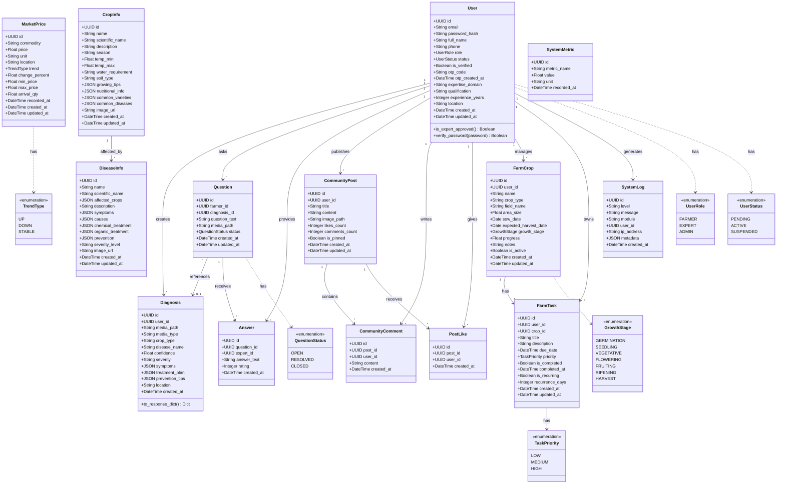

# Class Diagram

```mermaid
classDiagram
    %% ==================== USER MANAGEMENT ====================
    class User {
        +UUID id
        +String email
        +String password_hash
        +String full_name
        +String phone
        +UserRole role
        +UserStatus status
        +Boolean is_verified
        +String otp_code
        +DateTime otp_created_at
        +String expertise_domain
        +String qualification
        +Integer experience_years
        +String location
        +DateTime created_at
        +DateTime updated_at
        +is_expert_approved() Boolean
        +verify_password(password) Boolean
    }
    
    class UserRole {
        <<enumeration>>
        FARMER
        EXPERT
        ADMIN
    }
    
    class UserStatus {
        <<enumeration>>
        PENDING
        ACTIVE
        SUSPENDED
    }
    
    %% ==================== DIAGNOSIS ====================
    class Diagnosis {
        +UUID id
        +UUID user_id
        +String media_path
        +String media_type
        +String crop_type
        +String disease_name
        +Float confidence
        +String severity
        +JSON symptoms
        +JSON treatment_plan
        +JSON prevention_tips
        +String location
        +DateTime created_at
        +to_response_dict() Dict
    }
    
    %% ==================== Q&A SYSTEM ====================
    class Question {
        +UUID id
        +UUID farmer_id
        +UUID diagnosis_id
        +String question_text
        +String media_path
        +QuestionStatus status
        +DateTime created_at
        +DateTime updated_at
    }
    
    class Answer {
        +UUID id
        +UUID question_id
        +UUID expert_id
        +String answer_text
        +Integer rating
        +DateTime created_at
    }
    
    class QuestionStatus {
        <<enumeration>>
        OPEN
        RESOLVED
        CLOSED
    }
    
    %% ==================== COMMUNITY ====================
    class CommunityPost {
        +UUID id
        +UUID user_id
        +String title
        +String content
        +String image_path
        +Integer likes_count
        +Integer comments_count
        +Boolean is_pinned
        +DateTime created_at
        +DateTime updated_at
    }
    
    class CommunityComment {
        +UUID id
        +UUID post_id
        +UUID user_id
        +String content
        +DateTime created_at
    }
    
    class PostLike {
        +UUID id
        +UUID post_id
        +UUID user_id
        +DateTime created_at
    }
    
    %% ==================== MARKET ====================
    class MarketPrice {
        +UUID id
        +String commodity
        +Float price
        +String unit
        +String location
        +TrendType trend
        +Float change_percent
        +Float min_price
        +Float max_price
        +Float arrival_qty
        +DateTime recorded_at
        +DateTime created_at
        +DateTime updated_at
    }
    
    class TrendType {
        <<enumeration>>
        UP
        DOWN
        STABLE
    }
    
    %% ==================== FARM MANAGEMENT ====================
    class FarmCrop {
        +UUID id
        +UUID user_id
        +String name
        +String crop_type
        +String field_name
        +Float area_size
        +Date sow_date
        +Date expected_harvest_date
        +GrowthStage growth_stage
        +Float progress
        +String notes
        +Boolean is_active
        +DateTime created_at
        +DateTime updated_at
    }
    
    class FarmTask {
        +UUID id
        +UUID user_id
        +UUID crop_id
        +String title
        +String description
        +DateTime due_date
        +TaskPriority priority
        +Boolean is_completed
        +DateTime completed_at
        +Boolean is_recurring
        +Integer recurrence_days
        +DateTime created_at
        +DateTime updated_at
    }
    
    class GrowthStage {
        <<enumeration>>
        GERMINATION
        SEEDLING
        VEGETATIVE
        FLOWERING
        FRUITING
        RIPENING
        HARVEST
    }
    
    class TaskPriority {
        <<enumeration>>
        LOW
        MEDIUM
        HIGH
    }
    
    %% ==================== ENCYCLOPEDIA ====================
    class CropInfo {
        +UUID id
        +String name
        +String scientific_name
        +String description
        +String season
        +Float temp_min
        +Float temp_max
        +String water_requirement
        +String soil_type
        +JSON growing_tips
        +JSON nutritional_info
        +JSON common_varieties
        +JSON common_diseases
        +String image_url
        +DateTime created_at
        +DateTime updated_at
    }
    
    class DiseaseInfo {
        +UUID id
        +String name
        +String scientific_name
        +JSON affected_crops
        +String description
        +JSON symptoms
        +JSON causes
        +JSON chemical_treatment
        +JSON organic_treatment
        +JSON prevention
        +String severity_level
        +String image_url
        +DateTime created_at
        +DateTime updated_at
    }
    
    %% ==================== SYSTEM ====================
    class SystemLog {
        +UUID id
        +String level
        +String message
        +String module
        +UUID user_id
        +String ip_address
        +JSON metadata
        +DateTime created_at
    }
    
    class SystemMetric {
        +UUID id
        +String metric_name
        +Float value
        +String unit
        +DateTime recorded_at
    }
    
    %% ==================== RELATIONSHIPS ====================
    User "1" --> "*" Diagnosis : creates
    User "1" --> "*" Question : asks
    User "1" --> "*" Answer : provides
    User "1" --> "*" CommunityPost : publishes
    User "1" --> "*" CommunityComment : writes
    User "1" --> "*" PostLike : gives
    User "1" --> "*" FarmCrop : manages
    User "1" --> "*" FarmTask : owns
    User "1" --> "*" SystemLog : generates
    
    Question "*" --> "0..1" Diagnosis : references
    Question "1" --> "*" Answer : receives
    
    CommunityPost "1" --> "*" CommunityComment : contains
    CommunityPost "1" --> "*" PostLike : receives
    
    FarmCrop "1" --> "*" FarmTask : has
    
    CropInfo "1" --> "*" DiseaseInfo : affected_by
    
    User ..> UserRole : has
    User ..> UserStatus : has
    Question ..> QuestionStatus : has
    MarketPrice ..> TrendType : has
    FarmCrop ..> GrowthStage : has
    FarmTask ..> TaskPriority : has
```
