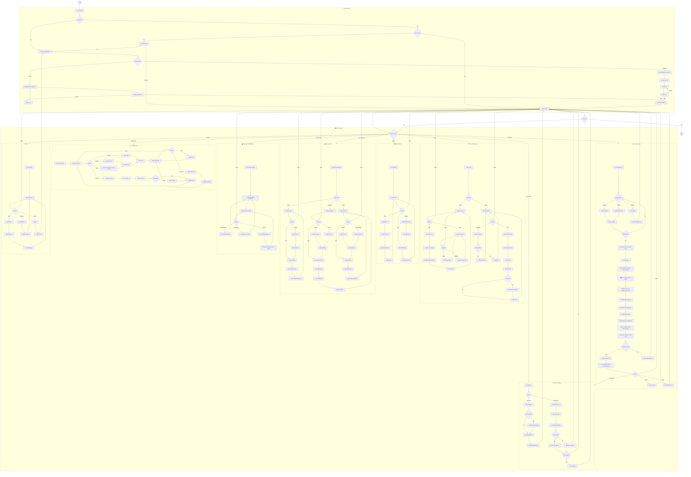

# Activity Diagram

```mermaid
flowchart TD
    START((🚀 Start)) --> LAUNCH[Launch App]
    
    %% ==================== AUTHENTICATION ====================
    subgraph AUTH["🔐 Authentication"]
        LAUNCH --> CHECK_AUTH{Logged In?}
        CHECK_AUTH -->|No| SHOW_AUTH[Show Login/Register]
        CHECK_AUTH -->|Yes| CHECK_TOKEN{Token Valid?}
        
        CHECK_TOKEN -->|No| REFRESH_TOKEN[Refresh Token]
        REFRESH_TOKEN -->|Success| HOME
        REFRESH_TOKEN -->|Fail| SHOW_AUTH
        CHECK_TOKEN -->|Yes| HOME
        
        SHOW_AUTH --> AUTH_CHOICE{Choose Action}
        AUTH_CHOICE -->|Login| ENTER_CREDS[Enter Email & Password]
        AUTH_CHOICE -->|Register| ENTER_REG[Enter Registration Details]
        
        ENTER_CREDS --> VALIDATE_LOGIN[Validate Credentials]
        VALIDATE_LOGIN -->|Invalid| SHOW_ERROR[Show Error]
        SHOW_ERROR --> ENTER_CREDS
        VALIDATE_LOGIN -->|Valid| STORE_TOKEN[Store JWT Tokens]
        STORE_TOKEN --> HOME
        
        ENTER_REG --> CREATE_ACCOUNT[Create Account]
        CREATE_ACCOUNT --> SEND_OTP[Send OTP]
        SEND_OTP --> VERIFY_OTP[Enter OTP]
        VERIFY_OTP -->|Invalid| SEND_OTP
        VERIFY_OTP -->|Valid| STORE_TOKEN
    end
    
    %% ==================== HOME & NAVIGATION ====================
    subgraph MAIN["🏠 Main Navigation"]
        HOME[Home Screen] --> NAV_CHOICE{Select Feature}
        
        NAV_CHOICE -->|Diagnosis| DIAG_FLOW
        NAV_CHOICE -->|Ask Expert| QA_FLOW
        NAV_CHOICE -->|Community| COMM_FLOW
        NAV_CHOICE -->|Farm| FARM_FLOW
        NAV_CHOICE -->|Market| MARKET_FLOW
        NAV_CHOICE -->|Encyclopedia| ENC_FLOW
        NAV_CHOICE -->|Profile| PROFILE_FLOW
        NAV_CHOICE -->|Disease Map| MAP_FLOW
    end
    
    %% ==================== DISEASE DIAGNOSIS ====================
    subgraph DIAG_FLOW["🔬 Disease Diagnosis"]
        D_START[Open Diagnosis] --> D_SOURCE{Image Source?}
        D_SOURCE -->|Camera| D_CAPTURE[Capture Photo]
        D_SOURCE -->|Gallery| D_SELECT[Select from Gallery]
        D_SOURCE -->|History| D_HISTORY[View History]
        
        D_CAPTURE --> D_PREVIEW[Preview Image]
        D_SELECT --> D_PREVIEW
        
        D_PREVIEW --> D_QUALITY{Quality OK?}
        D_QUALITY -->|No| D_SOURCE
        D_QUALITY -->|Yes| D_ADD_INFO[Add Crop Type, Location & GPS]
        
        D_ADD_INFO --> D_UPLOAD[Upload Image]
        D_UPLOAD --> D_PROCESS[POST /diagnosis/predict → AI Processing...]
        
        %% Server-Side ML Inference
        D_PROCESS --> D_TFLITE[🖥️ Server: Keras / TFLite Model]
        D_TFLITE --> D_LABEL[Disease Label e.g. apple_apple_scab]
        D_LABEL --> D_DSS[🧠 DSSService: Advisory]
        D_DSS --> D_WEATHER[Weather + Farmer Inputs]
        D_WEATHER --> D_RISK[Compute Risk Score]
        D_RISK --> D_ADVISORY[DSS Advisory + Treatments]
        
        %% Stored in single response
        D_ADVISORY --> D_SAVE_BACKEND[Saved to DB with GPS + DSS snapshot]
        D_SAVE_BACKEND --> D_ML2_RESULT[Chemical + Organic + Risk Level]
        D_ML2_RESULT --> D_RESULT{Disease Found?}
        
        D_RESULT -->|Yes| D_SHOW_DISEASE[Show Disease Info]
        D_RESULT -->|No| D_HEALTHY[Show Healthy Status]
        
        D_SHOW_DISEASE --> D_TREATMENT[View Treatment Plan + DSS Advisory]
        D_TREATMENT --> D_ACTIONS{Action?}
        D_ACTIONS -->|Ask Expert| QA_FLOW
        D_ACTIONS -->|Share| D_SHARE[Share Result]
        D_ACTIONS -->|Rate| D_RATE[Rate Diagnosis ⭐]
        D_ACTIONS -->|Done| HOME
        
        D_HEALTHY --> HOME
        D_RATE --> HOME
        D_HISTORY --> D_VIEW_DETAIL[View Past Diagnosis]
        D_VIEW_DETAIL --> HOME
        D_SHARE --> HOME
    end
    
    %% ==================== EXPERT Q&A ====================
    subgraph QA_FLOW["💬 Expert Consultation"]
        Q_START[Open Q&A] --> Q_CHOICE{Action?}
        Q_CHOICE -->|Ask New| Q_WRITE[Write Question]
        Q_CHOICE -->|View Mine| Q_MY_LIST[My Questions List]
        
        Q_WRITE --> Q_ATTACH{Attach Image?}
        Q_ATTACH -->|Yes| Q_ADD_IMG[Select/Capture Image]
        Q_ATTACH -->|No| Q_SUBMIT
        Q_ADD_IMG --> Q_SUBMIT[Submit Question]
        
        Q_SUBMIT --> Q_CONFIRM[Question Submitted!]
        Q_CONFIRM --> HOME
        
        Q_MY_LIST --> Q_SELECT[Select Question]
        Q_SELECT --> Q_DETAIL[View Question Detail]
        Q_DETAIL --> Q_HAS_ANSWER{Has Answer?}
        Q_HAS_ANSWER -->|Yes| Q_VIEW_ANS[View Expert Answer]
        Q_HAS_ANSWER -->|No| Q_WAIT[Waiting for Expert...]
        
        Q_VIEW_ANS --> Q_RATE{Rate Answer?}
        Q_RATE -->|Yes| Q_GIVE_RATING[Give 1-5 Stars]
        Q_RATE -->|No| HOME
        Q_GIVE_RATING --> HOME
        Q_WAIT --> HOME
    end
    
    %% ==================== COMMUNITY FORUM ====================
    subgraph COMM_FLOW["👥 Community Forum"]
        C_START[Open Community] --> C_LOAD[Load Posts Feed]
        C_LOAD --> C_ACTION{Action?}
        
        C_ACTION -->|Browse| C_SCROLL[Scroll Posts]
        C_ACTION -->|Search| C_SEARCH[Search Posts]
        C_ACTION -->|Create| C_NEW_POST[Create New Post]
        C_ACTION -->|Filter| C_FILTER[Filter by Category / Expert Only]
        
        C_SCROLL --> C_SELECT_POST[Select Post]
        C_SEARCH --> C_RESULTS[View Results]
        C_FILTER --> C_RESULTS
        C_RESULTS --> C_SELECT_POST
        
        C_SELECT_POST --> C_VIEW_POST[View Post Detail]
        C_VIEW_POST --> C_POST_ACTION{Action?}
        
        C_POST_ACTION -->|Like| C_TOGGLE_LIKE[Toggle Like]
        C_POST_ACTION -->|Comment| C_WRITE_COMMENT[Write Comment]
        C_POST_ACTION -->|Back| C_LOAD
        
        C_TOGGLE_LIKE --> C_VIEW_POST
        C_WRITE_COMMENT --> C_SUBMIT_COMMENT[Submit Comment]
        C_SUBMIT_COMMENT --> C_VIEW_POST
        
        C_NEW_POST --> C_ENTER_TITLE[Enter Title]
        C_ENTER_TITLE --> C_ENTER_CONTENT[Write Content]
        C_ENTER_CONTENT --> C_ADD_POST_IMG{Add Image?}
        C_ADD_POST_IMG -->|Yes| C_SELECT_IMG[Select Image]
        C_ADD_POST_IMG -->|No| C_PUBLISH
        C_SELECT_IMG --> C_PUBLISH[Publish Post]
        C_PUBLISH --> C_LOAD
    end
    
    %% ==================== FARM MANAGEMENT ====================
    subgraph FARM_FLOW["🌾 Farm Management"]
        F_START[Open Farm] --> F_TABS{Select Tab}
        
        F_TABS -->|Crops| F_CROP_LIST[View My Crops]
        F_TABS -->|Tasks| F_TASK_LIST[View My Tasks]
        
        F_CROP_LIST --> F_CROP_ACTION{Action?}
        F_CROP_ACTION -->|Add| F_ADD_CROP[Add New Crop]
        F_CROP_ACTION -->|View| F_CROP_DETAIL[View Crop Detail]
        F_CROP_ACTION -->|Back| HOME
        
        F_ADD_CROP --> F_ENTER_CROP[Enter Crop Details]
        F_ENTER_CROP --> F_SET_DATES[Set Sow/Harvest Dates]
        F_SET_DATES --> F_SAVE_CROP[Save Crop]
        F_SAVE_CROP --> F_CROP_LIST
        
        F_CROP_DETAIL --> F_UPDATE_CROP{Update?}
        F_UPDATE_CROP -->|Stage| F_SET_STAGE[Set Growth Stage]
        F_UPDATE_CROP -->|Progress| F_SET_PROGRESS[Update Progress %]
        F_UPDATE_CROP -->|Back| F_CROP_LIST
        F_SET_STAGE --> F_CROP_DETAIL
        F_SET_PROGRESS --> F_CROP_DETAIL
        
        F_TASK_LIST --> F_TASK_ACTION{Action?}
        F_TASK_ACTION -->|Add| F_ADD_TASK[Create New Task]
        F_TASK_ACTION -->|Complete| F_COMPLETE_TASK[Mark Complete]
        F_TASK_ACTION -->|Back| HOME
        
        F_ADD_TASK --> F_TASK_DETAILS[Enter Task Details]
        F_TASK_DETAILS --> F_SET_PRIORITY[Set Priority]
        F_SET_PRIORITY --> F_SET_DUE[Set Due Date]
        F_SET_DUE --> F_RECURRING{Recurring?}
        F_RECURRING -->|Yes| F_SET_RECURRENCE[Set Recurrence Days]
        F_RECURRING -->|No| F_SAVE_TASK
        F_SET_RECURRENCE --> F_SAVE_TASK[Save Task]
        F_SAVE_TASK --> F_TASK_LIST
        
        F_COMPLETE_TASK --> F_CHECK_RECURRING{Is Recurring?}
        F_CHECK_RECURRING -->|Yes| F_CREATE_NEXT[Create Next Task]
        F_CHECK_RECURRING -->|No| F_TASK_DONE[Task Done]
        F_CREATE_NEXT --> F_TASK_LIST
        F_TASK_DONE --> F_TASK_LIST
    end
    
    %% ==================== MARKET PRICES ====================
    subgraph MARKET_FLOW["📊 Market Prices"]
        M_START[Open Market] --> M_LOAD[Load Prices]
        M_LOAD --> M_ACTION{Action?}
        
        M_ACTION -->|Filter| M_FILTER[Apply Filters]
        M_ACTION -->|Search| M_SEARCH_COMMODITY[Search Commodity]
        M_ACTION -->|View| M_DETAIL[View Price Detail]
        M_ACTION -->|Back| HOME
        
        M_FILTER --> M_SELECT_LOCATION[Select Location]
        M_SELECT_LOCATION --> M_SELECT_COMMODITY[Select Commodity]
        M_SELECT_COMMODITY --> M_APPLY_FILTER[Apply Filter]
        M_APPLY_FILTER --> M_LOAD
        
        M_SEARCH_COMMODITY --> M_SHOW_RESULTS[Show Results]
        M_SHOW_RESULTS --> M_DETAIL
        
        M_DETAIL --> M_VIEW_TREND[View Price Trend]
        M_VIEW_TREND --> M_LOAD
    end
    
    %% ==================== ENCYCLOPEDIA ====================
    subgraph ENC_FLOW["📚 Encyclopedia"]
        E_START[Open Encyclopedia] --> E_TABS{Select Tab}
        
        E_TABS -->|Crops| E_CROP_LIST[Browse Crops]
        E_TABS -->|Diseases| E_DISEASE_LIST[Browse Diseases]
        E_TABS -->|Pests| E_PEST_LIST[Browse Pests]
        
        E_CROP_LIST --> E_CROP_ACTION{Action?}
        E_CROP_ACTION -->|Search| E_SEARCH_CROP[Search Crop]
        E_CROP_ACTION -->|View| E_CROP_DETAIL[View Crop Info]
        E_CROP_ACTION -->|Back| HOME
        
        E_SEARCH_CROP --> E_CROP_RESULTS[Show Results]
        E_CROP_RESULTS --> E_CROP_DETAIL
        
        E_CROP_DETAIL --> E_VIEW_GROWING[View Growing Tips]
        E_VIEW_GROWING --> E_VIEW_DISEASES[View Common Diseases]
        E_VIEW_DISEASES --> E_CROP_LIST
        
        E_DISEASE_LIST --> E_DISEASE_ACTION{Action?}
        E_DISEASE_ACTION -->|Search| E_SEARCH_DISEASE[Search Disease]
        E_DISEASE_ACTION -->|Filter| E_FILTER_CROP[Filter by Crop]
        E_DISEASE_ACTION -->|View| E_DISEASE_DETAIL[View Disease Info]
        E_DISEASE_ACTION -->|Back| HOME
        
        E_SEARCH_DISEASE --> E_DISEASE_RESULTS[Show Results]
        E_FILTER_CROP --> E_DISEASE_RESULTS
        E_DISEASE_RESULTS --> E_DISEASE_DETAIL
        
        E_DISEASE_DETAIL --> E_VIEW_SYMPTOMS[View Symptoms]
        E_VIEW_SYMPTOMS --> E_VIEW_TREATMENT[View Treatment]
        E_VIEW_TREATMENT --> E_VIEW_PREVENTION[View Prevention]
        E_VIEW_PREVENTION --> E_DISEASE_LIST
        
        E_PEST_LIST --> E_PEST_ACTION{Action?}
        E_PEST_ACTION -->|Search| E_SEARCH_PEST[Search Pest]
        E_PEST_ACTION -->|Filter Severity| E_FILTER_SEVERITY[Filter by Severity]
        E_PEST_ACTION -->|View| E_PEST_DETAIL[View Pest Info]
        E_PEST_ACTION -->|Back| HOME
        
        E_SEARCH_PEST --> E_PEST_RESULTS[Show Results]
        E_FILTER_SEVERITY --> E_PEST_RESULTS
        E_PEST_RESULTS --> E_PEST_DETAIL
        
        E_PEST_DETAIL --> E_VIEW_APPEARANCE[View Appearance]
        E_VIEW_APPEARANCE --> E_VIEW_CONTROLS[View Control Methods]
        E_VIEW_CONTROLS --> E_PEST_LIST
    end
    
    %% ==================== DISEASE OUTBREAK MAP ====================
    subgraph MAP_FLOW["🗺️ Disease Outbreak Map"]
        MAP_START[Open Disease Map] --> MAP_LOAD[Load Geo-tagged Diagnoses]
        MAP_LOAD --> MAP_DISPLAY[Display Pins on Map]
        
        MAP_DISPLAY --> MAP_ACTION{Action?}
        MAP_ACTION -->|Filter Disease| MAP_FILTER[Select Disease Filter]
        MAP_ACTION -->|Filter Days| MAP_DAYS[Set Lookback Period]
        MAP_ACTION -->|Tap Pin| MAP_PIN[View Outbreak Detail]
        MAP_ACTION -->|Back| HOME
        
        MAP_FILTER --> MAP_LOAD
        MAP_DAYS --> MAP_LOAD
        MAP_PIN --> MAP_DETAIL[Disease / Severity / Crop / Date]
        MAP_DETAIL --> MAP_DISPLAY
    end
    
    %% ==================== PROFILE ====================
    subgraph PROFILE_FLOW["👤 Profile"]
        P_START[Open Profile] --> P_VIEW[View Profile Info]
        P_VIEW --> P_ACTION{Action?}
        
        P_ACTION -->|Edit| P_EDIT[Edit Profile]
        P_ACTION -->|Settings| P_SETTINGS[App Settings]
        P_ACTION -->|Logout| P_LOGOUT[Logout]
        P_ACTION -->|Back| HOME
        
        P_EDIT --> P_UPDATE[Update Details]
        P_UPDATE --> P_SAVE[Save Changes]
        P_SAVE --> P_VIEW
        
        P_SETTINGS --> P_TOGGLE[Toggle Settings]
        P_TOGGLE --> P_VIEW
        
        P_LOGOUT --> CLEAR_TOKEN[Clear Tokens]
        CLEAR_TOKEN --> SHOW_AUTH
    end
    
    %% End point
    HOME --> END_CHOICE{Exit App?}
    END_CHOICE -->|No| NAV_CHOICE
    END_CHOICE -->|Yes| FINISH((🏁 End))
```