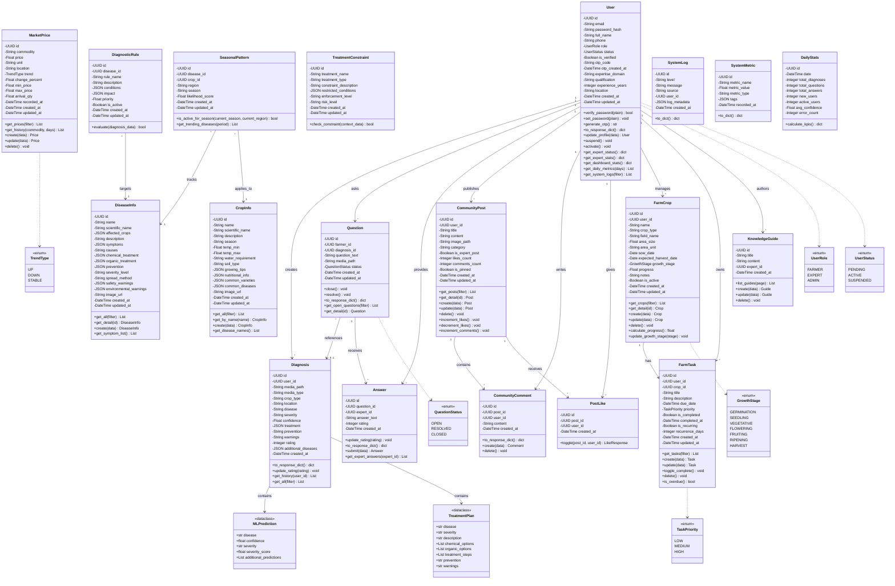

# Class Diagram

## Entity Models

```mermaid
classDiagram

    %% ==================== USER MANAGEMENT ====================
    class User {
        -UUID id
        -String email
        -String password_hash
        -String full_name
        -String phone
        -UserRole role
        -UserStatus status
        -Boolean is_verified
        -String otp_code
        -DateTime otp_created_at
        -String expertise_domain
        -String qualification
        -Integer experience_years
        -String location
        -DateTime created_at
        -DateTime updated_at
        +verify_password(plain) bool
        +set_password(plain) void
        +generate_otp() str
        +to_response_dict() dict
        +update_profile(data) User
        +suspend() void
        +activate() void
        +get_expert_status() dict
        +get_expert_stats() dict
        +get_dashboard_stats() dict
        +get_daily_metrics(days) List
        +get_system_logs(filter) List
    }
    
    class UserRole {
        <<enum>>
        FARMER
        EXPERT
        ADMIN
    }
    
    class UserStatus {
        <<enum>>
        PENDING
        ACTIVE
        SUSPENDED
    }
    
    %% ==================== DIAGNOSIS ====================
    class Diagnosis {
        -UUID id
        -UUID user_id
        -String media_path
        -String media_type
        -String crop_type
        -String location
        -String disease
        -String severity
        -Float confidence
        -JSON treatment
        -String prevention
        -String warnings
        -Integer rating
        -JSON additional_diseases
        -DateTime created_at
        +to_response_dict() dict
        +update_rating(rating) void
        +get_history(user_id) List
        +get_all(filter) List
    }
    
    %% ==================== Q&A SYSTEM ====================
    class Question {
        -UUID id
        -UUID farmer_id
        -UUID diagnosis_id
        -String question_text
        -String media_path
        -QuestionStatus status
        -DateTime created_at
        -DateTime updated_at
        +close() void
        +resolve() void
        +to_response_dict() dict
        +get_open_questions(filter) List
        +get_detail(id) Question
    }
    
    class Answer {
        -UUID id
        -UUID question_id
        -UUID expert_id
        -String answer_text
        -Integer rating
        -DateTime created_at
        +update_rating(rating) void
        +to_response_dict() dict
        +submit(data) Answer
        +get_expert_answers(expert_id) List
    }
    
    class QuestionStatus {
        <<enum>>
        OPEN
        RESOLVED
        CLOSED
    }
    
    %% ==================== COMMUNITY ====================
    class CommunityPost {
        -UUID id
        -UUID user_id
        -String title
        -String content
        -String image_path
        -String category
        -Boolean is_expert_post
        -Integer likes_count
        -Integer comments_count
        -Boolean is_pinned
        -DateTime created_at
        -DateTime updated_at
        +get_posts(filter) List
        +get_detail(id) Post
        +create(data) Post
        +update(data) Post
        +delete() void
        +increment_likes() void
        +decrement_likes() void
        +increment_comments() void
    }
    
    class CommunityComment {
        -UUID id
        -UUID post_id
        -UUID user_id
        -String content
        -DateTime created_at
        +to_response_dict() dict
        +create(data) Comment
        +delete() void
    }
    
    class PostLike {
        -UUID id
        -UUID post_id
        -UUID user_id
        -DateTime created_at
        +toggle(post_id, user_id) LikeResponse
    }
    
    %% ==================== FARM MANAGEMENT ====================
    class FarmCrop {
        -UUID id
        -UUID user_id
        -String name
        -String crop_type
        -String field_name
        -Float area_size
        -String area_unit
        -Date sow_date
        -Date expected_harvest_date
        -GrowthStage growth_stage
        -Float progress
        -String notes
        -Boolean is_active
        -DateTime created_at
        -DateTime updated_at
        +get_crops(filter) List
        +get_detail(id) Crop
        +create(data) Crop
        +update(data) Crop
        +delete() void
        +calculate_progress() float
        +update_growth_stage(stage) void
    }
    
    class FarmTask {
        -UUID id
        -UUID user_id
        -UUID crop_id
        -String title
        -String description
        -DateTime due_date
        -TaskPriority priority
        -Boolean is_completed
        -DateTime completed_at
        -Boolean is_recurring
        -Integer recurrence_days
        -DateTime created_at
        -DateTime updated_at
        +get_tasks(filter) List
        +create(data) Task
        +update(data) Task
        +toggle_complete() void
        +delete() void
        +is_overdue() bool
    }
    
    class GrowthStage {
        <<enum>>
        GERMINATION
        SEEDLING
        VEGETATIVE
        FLOWERING
        FRUITING
        RIPENING
        HARVEST
    }
    
    class TaskPriority {
        <<enum>>
        LOW
        MEDIUM
        HIGH
    }
    
    %% ==================== MARKET ====================
    class MarketPrice {
        -UUID id
        -String commodity
        -Float price
        -String unit
        -String location
        -TrendType trend
        -Float change_percent
        -Float min_price
        -Float max_price
        -Float arrival_qty
        -DateTime recorded_at
        -DateTime created_at
        -DateTime updated_at
        +get_prices(filter) List
        +get_history(commodity, days) List
        +create(data) Price
        +update(data) Price
        +delete() void
    }
    
    class TrendType {
        <<enum>>
        UP
        DOWN
        STABLE
    }
    
    %% ==================== ENCYCLOPEDIA ====================
    class CropInfo {
        -UUID id
        -String name
        -String scientific_name
        -String description
        -String season
        -Float temp_min
        -Float temp_max
        -String water_requirement
        -String soil_type
        -JSON growing_tips
        -JSON nutritional_info
        -JSON common_varieties
        -JSON common_diseases
        -String image_url
        -DateTime created_at
        -DateTime updated_at
        +get_all(filter) List
        +get_by_name(name) CropInfo
        +create(data) CropInfo
        +get_disease_names() List<str>
    }
    
    class DiseaseInfo {
        -UUID id
        -String name
        -String scientific_name
        -JSON affected_crops
        -String description
        -JSON symptoms
        -String causes
        -JSON chemical_treatment
        -JSON organic_treatment
        -JSON prevention
        -String severity_level
        -String spread_method
        -JSON safety_warnings
        -JSON environmental_warnings
        -String image_url
        -DateTime created_at
        -DateTime updated_at
        +get_all(filter) List
        +get_detail(id) DiseaseInfo
        +create(data) DiseaseInfo
        +get_symptom_list() List<str>
    }
    
    %% ==================== AGRONOMY INTELLIGENCE ====================
    class DiagnosticRule {
        -UUID id
        -UUID disease_id
        -String rule_name
        -String description
        -JSON conditions
        -JSON impact
        -Float priority
        -Boolean is_active
        -DateTime created_at
        -DateTime updated_at
        +evaluate(diagnosis_data) bool
    }
    
    class TreatmentConstraint {
        -UUID id
        -String treatment_name
        -String treatment_type
        -String constraint_description
        -JSON restricted_conditions
        -String enforcement_level
        -String risk_level
        -DateTime created_at
        -DateTime updated_at
        +check_constraint(context_data) bool
    }
    
    class SeasonalPattern {
        -UUID id
        -UUID disease_id
        -UUID crop_id
        -String region
        -String season
        -Float likelihood_score
        -DateTime created_at
        -DateTime updated_at
        +is_active_for_season(current_season, current_region) bool
        +get_trending_diseases(period) List
    }
    
    class KnowledgeGuide {
        -UUID id
        -String title
        -String content
        -UUID expert_id
        -DateTime created_at
        +list_guides(page) List
        +create(data) Guide
        +update(data) Guide
        +delete() void
    }

    %% ==================== SYSTEM MONITORING ====================
    class SystemLog {
        -UUID id
        -String level
        -String message
        -String source
        -UUID user_id
        -JSON log_metadata
        -DateTime created_at
        +to_dict() dict
    }
    
    class SystemMetric {
        -UUID id
        -String metric_name
        -Float metric_value
        -String metric_type
        -JSON tags
        -DateTime recorded_at
        +to_dict() dict
    }
    
    class DailyStats {
        -UUID id
        -DateTime date
        -Integer total_diagnoses
        -Integer total_questions
        -Integer total_answers
        -Integer new_users
        -Integer active_users
        -Float avg_confidence
        -Integer error_count
        +calculate_kpis() dict
    }
    
    %% ==================== RELATIONSHIPS ====================
    User "1" --> "*" Diagnosis : creates
    User "1" --> "*" Question : asks
    User "1" --> "*" Answer : provides
    User "1" --> "*" CommunityPost : publishes
    User "1" --> "*" CommunityComment : writes
    User "1" --> "*" PostLike : gives
    User "1" --> "*" FarmCrop : manages
    User "1" --> "*" FarmTask : owns
    User "1" --> "*" KnowledgeGuide : authors
    
    Question "*" --> "0..1" Diagnosis : references
    Question "1" --> "*" Answer : receives
    
    CommunityPost "1" --> "*" CommunityComment : contains
    CommunityPost "1" --> "*" PostLike : receives
    
    FarmCrop "1" --> "*" FarmTask : has
    
    %% Agronomy Relationships
    DiagnosticRule "*" --> "1" DiseaseInfo : targets
    SeasonalPattern "*" --> "1" DiseaseInfo : tracks
    SeasonalPattern "*" --> "1" CropInfo : applies_to
    
    %% Enum Dependencies
    User ..> UserRole
    User ..> UserStatus
    Question ..> QuestionStatus
    FarmCrop ..> GrowthStage
    FarmTask ..> TaskPriority
    MarketPrice ..> TrendType
    class MLPrediction {
        <<dataclass>>
        +str disease
        +float confidence
        +str severity
        +float severity_score
        +List additional_predictions
    }

    class TreatmentPlan {
        <<dataclass>>
        +str disease
        +str severity
        +str description
        +List chemical_options
        +List organic_options
        +List treatment_steps
        +str prevention
        +str warnings
    }

    Diagnosis --> MLPrediction : contains
    Diagnosis --> TreatmentPlan : contains
```
