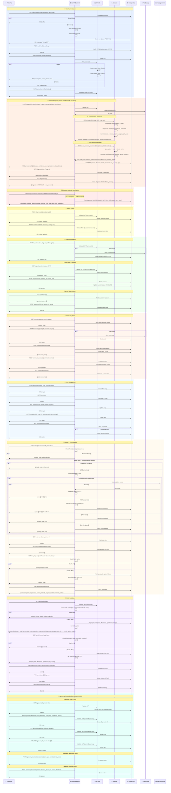

# Sequence Diagram

## API Interaction Flows

```mermaid
sequenceDiagram
    participant App as 📱 Flutter App
    participant API as 🖥️ FastAPI Backend
    participant Auth as 🔐 JWT Auth
    participant AI as 🤖 AI Model
    participant DB as 🗄️ PostgreSQL
    participant Storage as 💾 File Storage

    %% ==================== AUTHENTICATION ====================
    rect rgb(230, 240, 255)
        Note over App,DB: 🔐 User Authentication
        
        App->>API: POST /auth/register {email, password, name, role}
        API->>DB: Check if email exists
        alt Email Exists
            API-->>App: 409 Conflict
        else New User
            API->>API: Hash password (bcrypt)
            API->>API: Generate 6-digit OTP
            API->>DB: Create user (status=PENDING)
            API-->>App: 201 {message: "Verify OTP"}
        end
        
        App->>API: POST /auth/verify {email, otp}
        API->>DB: Verify OTP & Update status=ACTIVE
        API-->>App: 200 OK
        
        App->>API: POST /auth/login {email, password}
        API->>DB: Fetch user
        API->>Auth: Verify password
        alt Valid
            Auth->>Auth: Create access_token (30min)
            Auth->>Auth: Create refresh_token (7days)
            API-->>App: 200 {access_token, refresh_token, user}
        else Invalid
            API-->>App: 401 Unauthorized
        end
        
        App->>API: POST /auth/refresh {refresh_token}
        API->>Auth: Validate & Issue new token
        API-->>App: 200 {access_token}
    end

    %% ====================DISEASE DIAGNOSIS ====================
    rect rgb(255, 240, 230)
        Note over App,AI: 🔬 Disease Diagnosis (Server-Side Keras/TFLite + DSS)
        
        App->>API: POST /diagnosis/predict (multipart: image, crop_type, latitude?, longitude?)
        API->>Auth: Validate JWT
        API->>Storage: Save uploaded image
        Storage-->>API: file_path
        
        Note over API,AI: 1. Server-Side ML Inference
        API->>AI: MLService.predict(image_path, crop_type)
        AI->>AI: Load Keras model (fallback: TFLite)
        AI->>AI: Preprocess image (resize 224x224, normalize)
        AI->>AI: Run inference → disease_label e.g. apple_apple_scab
        AI-->>API: {disease, disease_id, confidence, severity, additional_predictions}
        
        Note over API,AI: 2. DSS Advisory (Backend)
        API->>AI: DSSService.generate_recommendation(disease_label, weather)
        AI->>AI: parse_label → crop + disease name
        AI->>AI: compute_risk(disease_type, weather, farmer_answers)
        AI-->>API: {risk_score, risk_level, treatment_options, irrigation_advice, crop_rotation_advice}
        
        API->>DB: INSERT diagnoses (disease, severity, treatment, dss_advisory, gps)
        API-->>App: Full diagnosis result {id, disease, confidence, severity, treatment, dss_advisory}
        
        App->>API: GET /diagnosis/history?page=1
        API->>DB: Fetch user's diagnoses
        API-->>App: {diagnoses[], total, page}
        
        App->>API: GET /diagnosis/{id}
        API->>DB: Fetch diagnosis detail with dss_advisory
        API-->>App: {diagnosis with full details + dss_advisory}
    end

    %% ==================== DISEASE OUTBREAK MAP ====================
    rect rgb(255, 235, 235)
        Note over App,DB: 🗺️ Disease Outbreak Map (Public)
        
        App->>API: GET /diagnosis/disease-map?days=30&disease=Leaf%20Blight
        Note over API: No auth required — public endpoint
        API->>DB: Fetch diagnoses WHERE latitude IS NOT NULL AND created_at >= cutoff
        API-->>App: {outbreaks: [{disease, severity, latitude, longitude, crop_type, date}], total, diseases[]}
    end

    %% ==================== RATING SYSTEM ====================
    rect rgb(255, 255, 220)
        Note over App,DB: ⭐ Rating System
        
        App->>API: POST /diagnosis/{id}/rate {rating: 1-5}
        API->>Auth: Validate JWT (Owner only)
        API->>DB: Update diagnosis rating
        API-->>App: 200 {rating_updated}
        
        App->>API: POST /questions/{qid}/rate {answer_id, rating: 1-5}
        API->>Auth: Validate JWT (Question owner only)
        API->>DB: Update answer rating
        API-->>App: 200 {rating_updated}
    end

    %% ==================== EXPERT Q&A ====================
    rect rgb(240, 255, 240)
        Note over App,DB: 💬 Expert Consultation
        
        App->>API: POST /questions {text, diagnosis_id?, image?}
        API->>Auth: Validate JWT (Farmer only)
        opt Has Image
            API->>Storage: Save question image
        end
        API->>DB: Create question (status=OPEN)
        API-->>App: 201 {question_id}
        
        Note over App,DB: Expert Views & Answers
        App->>API: GET /expert/questions?status=OPEN
        API->>Auth: Validate JWT (Expert only, approved)
        API->>DB: Fetch open questions
        API-->>App: {questions[], total}
        
        App->>API: POST /expert/answer {question_id, answer_text}
        API->>DB: Create answer
        API->>DB: Update question status=RESOLVED
        API-->>App: 201 {answer}
        
        Note over App,DB: Farmer Views Answer
        App->>API: GET /questions/{id}
        API->>DB: Fetch question + answers
        API-->>App: {question, answers[]}
        
        App->>API: POST /questions/{id}/rate {answer_id, rating}
        API->>DB: Update answer rating
        API-->>App: 200 OK
    end

    %% ==================== COMMUNITY ====================
    rect rgb(255, 245, 238)
        Note over App,DB: 👥 Community Forum
        
        App->>API: GET /community/posts?search=&page=1
        API->>DB: Fetch posts with likes status
        API-->>App: {posts[], total}
        
        App->>API: POST /community/posts {title, content, image?}
        opt Has Image
            API->>Storage: Save post image
        end
        API->>DB: Create post
        API-->>App: 201 {post}
        
        App->>API: POST /community/posts/{id}/like
        API->>DB: Toggle like (create/delete)
        API->>DB: Update likes_count
        API-->>App: {liked, likes_count}
        
        App->>API: POST /community/posts/{id}/comments {content}
        API->>DB: Create comment
        API->>DB: Increment comments_count
        API-->>App: 201 {comment}
        
        App->>API: GET /community/posts/{id}
        API->>DB: Fetch post + comments
        API-->>App: {post, comments[]}
    end

    %% ==================== FARM MANAGEMENT ====================
    rect rgb(240, 248, 255)
        Note over App,DB: 🌾 Farm Management
        
        App->>API: POST /farm/crops {name, type, sow_date, area}
        API->>DB: Create farm crop
        API-->>App: 201 {crop}
        
        App->>API: GET /farm/crops
        API->>DB: Fetch user's crops
        API-->>App: {crops[]}
        
        App->>API: PUT /farm/crops/{id} {growth_stage, progress}
        API->>DB: Update crop
        API-->>App: 200 {crop}
        
        App->>API: POST /farm/tasks {title, crop_id?, due_date, priority, recurring?}
        API->>DB: Create task
        API-->>App: 201 {task}
        
        App->>API: PUT /farm/tasks/{id}/complete
        API->>DB: Mark completed
        alt Recurring Task
            API->>DB: Create next occurrence
        end
        API-->>App: 200 {task}
    end

    %% ==================== MARKET & ENCYCLOPEDIA ====================
    rect rgb(255, 250, 240)
        Note over App,DB: 📊 Market & Encyclopedia
        
        App->>API: GET /market/prices?commodity=&location=
        API->>API: Check Redis (key: market_cache:...)
        alt Redis Cache Hit
            API-->>App: {prices[], total} (Redis Cached)
        else Redis Miss — check in-memory fallback
            alt In-Memory Cache Hit
                API-->>App: {prices[], total} (In-Memory)
            else All Caches Miss
                API->>API: Check Agmarknet Config
                alt Configured & not rate-limited
                    API->>External(Agmarknet): Fetch real-time prices
                    alt Success
                        External(Agmarknet)-->>API: JSON Data
                        API->>API: Set Redis cache (1h TTL)
                        API-->>App: {prices[], total} (Live)
                    else 429 Rate Limited
                        API->>API: Set rate-limit backoff in Redis (1h)
                        API->>DB: Fallback to Database
                        API-->>App: {prices[], total} (DB Fallback)
                    else Other Error
                        API->>DB: Fallback to Database
                        API-->>App: {prices[], total} (DB)
                    end
                else Not Configured
                    API->>DB: Fetch from Database
                    API-->>App: {prices[], total} (DB)
                end
            end
        end
        
        App->>API: GET /encyclopedia/crops?search=
        API->>DB: Fetch crop info
        API-->>App: {crops[]}
        
        App->>API: GET /encyclopedia/diseases?crop=
        API->>DB: Fetch diseases for crop
        API-->>App: {diseases[]}
        
        App->>API: GET /encyclopedia/pests?search=&severity=&crop=
        API->>API: Check Redis cache
        alt Cache Hit
            API-->>App: {pests[], total} (Cached)
        else Cache Miss
            API->>DB: Fetch pests with optional filters
            API->>API: Set Redis cache (24h TTL)
            API-->>App: {pests[], total}
        end
        
        App->>API: GET /encyclopedia/pests/{id}
        API->>DB: Fetch pest detail
        API-->>App: {name, symptoms, appearance, control_methods, organic_control, chemical_control}
    end

    %% ==================== ADMIN ====================
    rect rgb(248, 240, 255)
        Note over App,DB: 🔧 Admin Dashboard
        
        App->>API: GET /admin/dashboard
        API->>Auth: Validate JWT (Admin only)
        API->>API: Check Redis cache (key: admin:dashboard, TTL 5min)
        alt Cache Hit
            API-->>App: {metrics, trends, system_health} (Cached)
        else Cache Miss
            API->>DB: Aggregate stats (users, diagnoses, questions, storage)
            API->>API: Set Redis cache
            API-->>App: {metrics: {total_users, total_farmers, total_experts, pending_experts, total_diagnoses, storage_used_mb, ...}, trends, system_health}
        end
        
        App->>API: GET /admin/metrics/daily?days=7
        API->>API: Check Redis cache (key: admin:daily_metrics:7)
        alt Cache Hit
            API-->>App: {metrics[]} (Cached)
        else Cache Miss
            API->>DB: Aggregate per-day stats
            API->>API: Set Redis cache (1min TTL)
            API-->>App: {metrics: [{date, diagnoses, questions, new_users}]}
        end
        
        App->>API: GET /admin/users?role=EXPERT&status=PENDING
        API->>DB: Fetch filtered users
        API-->>App: {users[]}
        
        App->>API: PUT /admin/users/{id}/approve
        API->>DB: Update status=ACTIVE
        API-->>App: 200 {user}
        
        App->>API: GET /admin/logs?level=ERROR
        API->>DB: Fetch system logs
        API-->>App: {logs[]}
    end

    %% ==================== AGRONOMY MANAGEMENT ====================
    rect rgb(230, 255, 250)
        Note over App,DB: 🧪 Agronomy Knowledge Base (Expert/Admin)
        
        Note over App,DB: Diagnostic Rules CRUD
        App->>API: GET /agronomy/diagnostic-rules
        API->>Auth: Validate JWT
        API->>DB: Fetch all rules with disease names
        API-->>App: {rules[]}
        
        App->>API: POST /agronomy/diagnostic-rules {disease_id, rule_name, conditions, impact}
        API->>Auth: Validate JWT (Admin/Expert only)
        API->>DB: Create diagnostic rule
        API-->>App: 201 {rule}
        
        App->>API: PUT /agronomy/diagnostic-rules/{id} {updates}
        API->>Auth: Validate JWT (Admin/Expert only)
        API->>DB: Update rule
        API-->>App: 200 {rule}
        
        App->>API: DELETE /agronomy/diagnostic-rules/{id}
        API->>Auth: Validate JWT (Admin/Expert only)
        API->>DB: Delete rule
        API-->>App: 204 No Content
        
        Note over App,DB: Treatment Constraints CRUD
        App->>API: POST /agronomy/treatment-constraints {name, type, constraint, risk_level}
        API->>DB: Create constraint
        API-->>App: 201 {constraint}
        
        Note over App,DB: Seasonal Patterns CRUD
        App->>API: POST /agronomy/seasonal-patterns {disease_id, crop_id, season, likelihood}
        API->>DB: Create pattern
        API-->>App: 201 {pattern}
    end
```

