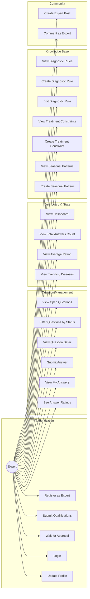
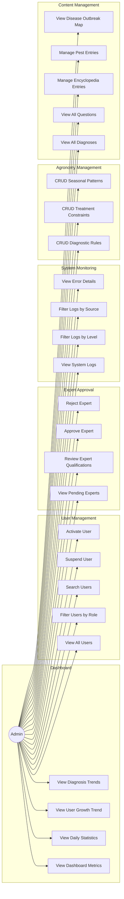

# Use Case Diagram

```mermaid
graph TB
    subgraph Actors
        F((👨‍🌾 Farmer))
        E((👨‍🔬 Expert))
        A((👨‍💼 Admin))
    end
    
    subgraph "Core Features"
        D[🔬 Disease Diagnosis]
        Q[💬 Ask Expert]
        C[👥 Community]
        FA[🌾 Farm Management]
        M[📊 Market Prices]
        EN[📚 Encyclopedia]
        R[⭐ Rate Answers]
        MAP[🗺️ Disease Outbreak Map]
        DSS[🧠 DSS Advisory]
    end
    
    subgraph "Expert Features"
        ANS[Answer Questions]
        DASH[Expert Dashboard]
        KB[📖 Knowledge Base]
        STATS[View My Stats]
    end
    
    subgraph "Admin Features"
        USR[Manage Users]
        APP[Approve Experts]
        LOG[System Logs]
        AGRO[🧪 Agronomy Rules]
        METRICS[📈 System Metrics]
        ENCYC[📝 Encyclopedia CRUD]
    end
    
    F --> D
    F --> Q
    F --> C
    F --> FA
    F --> M
    F --> EN
    F --> R
    F --> MAP
    F --> DSS
    
    E --> ANS
    E --> DASH
    E --> KB
    E --> STATS
    E --> C
    
    A --> USR
    A --> APP
    A --> LOG
    A --> AGRO
    A --> METRICS
    A --> ENCYC
```

---

## Detailed Use Cases by Actor

### 👨‍🌾 Farmer Use Cases

```mermaid
graph LR
    F((Farmer))
    
    subgraph Authentication
        F --> UC1[Register Account]
        F --> UC2[Verify OTP]
        F --> UC3[Login]
        F --> UC4[Forgot Password]
        F --> UC5[Update Profile]
    end
    
    subgraph "Disease Diagnosis"
        F --> UC10[Capture Image from Camera]
        F --> UC11[Select Image from Gallery]
        F --> UC12[Submit for AI Analysis]
        F --> UC13[View Diagnosis Result]
        F --> UC14[View Treatment Plan]
        F --> UC15[Rate AI Diagnosis]
        F --> UC16[View Diagnosis History]
        F --> UC17[Share Diagnosis]
        F --> UC18[Get DSS Advisory]
        F --> UC19[View Disease Outbreak Map]
    end
    
    subgraph "Expert Consultation"
        F --> UC20[Ask Question to Expert]
        F --> UC21[Attach Image to Question]
        F --> UC22[Link Question to Diagnosis]
        F --> UC23[View My Questions]
        F --> UC24[View Expert Answer]
        F --> UC25[Rate Expert Answer]
        F --> UC26[Close Question]
    end
    
    subgraph "Community Forum"
        F --> UC30[Browse Posts]
        F --> UC31[Search Posts]
        F --> UC32[Create Post]
        F --> UC33[Add Image to Post]
        F --> UC34[Like Post]
        F --> UC35[Comment on Post]
        F --> UC36[Delete Own Post]
        F --> UC37[Filter by Category]
        F --> UC38[Browse Expert Posts]
    end
    
    subgraph "Farm Management"
        F --> UC40[Add Farm Crop]
        F --> UC41[View My Crops]
        F --> UC42[Update Crop Stage]
        F --> UC43[Delete Crop]
        F --> UC44[Create Farm Task]
        F --> UC45[View Tasks]
        F --> UC46[Mark Task Complete]
        F --> UC47[Set Recurring Task]
    end
    
    subgraph "Market & Encyclopedia"
        F --> UC50[View Market Prices]
        F --> UC51[Filter by Location]
        F --> UC52[View Price Trends]
        F --> UC53[Browse Crop Encyclopedia]
        F --> UC54[Browse Disease Encyclopedia]
        F --> UC55[Search Encyclopedia]
        F --> UC56[Browse Pest Encyclopedia]
    end
```

---

### 👨‍🔬 Expert Use Cases

---

### 👨‍💼 Admin Use Cases

---

## Use Case Descriptions

### Farmer Use Cases
| ID | Use Case | Description | Precondition |
|----|----------|-------------|--------------|
| UC1 | Register Account | Create new account with email, password, full name | None |
| UC2 | Verify OTP | Enter 6-digit OTP sent to email | Registered |
| UC3 | Login | Authenticate with email/password | Verified |
| UC10 | Capture Image | Use device camera to take crop photo | Logged in |
| UC12 | Submit for Analysis | Send image to AI for disease detection | Image selected |
| UC13 | View Diagnosis Result | See disease name, confidence, severity, DSS advisory | Analysis complete |
| UC14 | View Treatment Plan | See chemical and organic treatment options | Diagnosis complete |
| UC15 | Rate AI Diagnosis | Give 1-5 star rating to diagnosis quality | Diagnosis complete |
| UC18 | Get DSS Advisory | Post disease label + weather, get risk-scored advisory | Diagnosis complete |
| UC19 | View Disease Outbreak Map | Map of geo-tagged disease reports (public) | None |
| UC20 | Ask Question | Submit text question to experts | Logged in |
| UC25 | Rate Expert Answer | Give 1-5 star rating to answer | Answer received |
| UC30 | Browse Posts | Scroll through community feed | Logged in |
| UC34 | Like Post | Toggle like on a post | Viewing post |
| UC37 | Filter by Category | Filter community posts by topic category | Logged in |
| UC40 | Add Farm Crop | Register new crop with sow date, area | Logged in |
| UC46 | Mark Task Complete | Complete a farm task | Task exists |
| UC56 | Browse Pest Encyclopedia | View pests with symptoms, controls, severity | Logged in |

### Expert Use Cases
| ID | Use Case | Description | Precondition |
|----|----------|-------------|--------------|
| EU1 | Register as Expert | Create expert account with qualifications | None |
| EU3 | Wait for Approval | Expert status is PENDING until admin approves | Registered |
| EU10 | View Open Questions | Browse questions needing answers | Approved expert |
| EU13 | Submit Answer | Write and submit answer to question | Viewing question |
| EU15 | See Answer Ratings | View ratings given by farmers | Has answers |
| EU31 | Create Diagnostic Rule | Add new rule for disease validation | Approved expert |

### Admin Use Cases
| ID | Use Case | Description | Precondition |
|----|----------|-------------|--------------|
| AU1 | View Dashboard | See aggregated system metrics | Admin role |
| AU11 | Filter Users | Search users by role, status, name | Admin role |
| AU13 | Suspend User | Deactivate a user account | Admin role |
| AU22 | Approve Expert | Change expert status to ACTIVE | Pending expert exists |
| AU30 | View System Logs | Browse application logs | Admin role |
| AU40 | CRUD Diagnostic Rules | Full management of diagnostic rules | Admin role |
