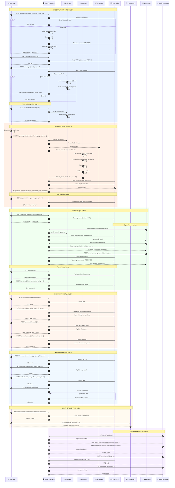

# Sequence Diagram

```mermaid
sequenceDiagram
    autonumber
    
    participant Mobile as 📱 Flutter App
    participant API as 🖥️ FastAPI Backend
    participant Auth as 🔐 JWT Auth
    participant AI as 🤖 AI Service
    participant Storage as 💾 File Storage
    participant DB as 🗄️ PostgreSQL
    participant Weather as 🌤️ Weather API
    participant Expert as 👨‍🔬 Expert App
    participant Admin as 👨‍💼 Admin Dashboard
    
    %% ==================== AUTHENTICATION ====================
    rect rgb(230, 240, 255)
        Note over Mobile,DB: 🔐 USER AUTHENTICATION FLOW
        
        Mobile->>API: POST /auth/register {email, password, name, role}
        API->>DB: Check if email exists
        alt Email Already Exists
            API-->>Mobile: 409 Conflict
        else New User
            API->>API: Hash password (bcrypt)
            API->>API: Generate OTP
            API->>DB: Create user (status=PENDING)
            API->>API: Send OTP via Email/SMS
            API-->>Mobile: 201 Created + "Verify OTP"
        end
        
        Mobile->>API: POST /auth/verify {email, otp}
        API->>DB: Verify OTP, Update status=ACTIVE
        API-->>Mobile: 200 OK
        
        Mobile->>API: POST /auth/login {email, password}
        API->>DB: Fetch user by email
        API->>Auth: Verify password hash
        alt Valid Credentials
            Auth->>Auth: Generate access_token (30min)
            Auth->>Auth: Generate refresh_token (7days)
            API-->>Mobile: 200 {access_token, refresh_token, user}
        else Invalid
            API-->>Mobile: 401 Unauthorized
        end
        
        Note over Mobile,API: Token Refresh (before expiry)
        Mobile->>API: POST /auth/refresh {refresh_token}
        API->>Auth: Verify refresh token
        Auth->>Auth: Generate new access_token
        API-->>Mobile: 200 {access_token}
    end
    
    %% ==================== DISEASE DIAGNOSIS ====================
    rect rgb(255, 240, 230)
        Note over Mobile,DB: 🔬 DISEASE DIAGNOSIS FLOW
        
        Mobile->>Mobile: Capture/Select crop image
        Mobile->>API: POST /diagnosis/predict (multipart: file, crop_type, location)
        API->>Auth: Validate JWT token
        API->>Storage: Save uploaded image
        Storage-->>API: Return file path
        
        API->>AI: Process image for disease detection
        AI->>AI: Load TensorFlow/PyTorch model
        AI->>AI: Preprocess image (resize, normalize)
        AI->>AI: Run inference
        AI->>AI: Get disease predictions
        AI-->>API: {disease_name, confidence, severity}
        
        API->>DB: Fetch treatment plan for disease
        API->>DB: Save diagnosis record
        DB-->>API: Diagnosis ID
        
        API-->>Mobile: 200 {disease, confidence, severity, treatment_plan, prevention}
        
        Note over Mobile,DB: View Diagnosis History
        Mobile->>API: GET /diagnosis/history?page=1&page_size=20
        API->>DB: Fetch user's diagnoses (paginated)
        API-->>Mobile: {diagnoses[], total, page}
    end
    
    %% ==================== EXPERT Q&A ====================
    rect rgb(240, 255, 240)
        Note over Mobile,Expert: 💬 EXPERT Q&A FLOW
        
        Mobile->>API: POST /questions {question_text, diagnosis_id?}
        API->>DB: Create question (status=OPEN)
        API-->>Mobile: 201 {question_id, message}
        
        Note over Expert,DB: Expert Views Questions
        Expert->>API: GET /expert/questions?status=OPEN
        API->>Auth: Verify expert is approved
        API->>DB: Fetch open questions with farmer info
        API-->>Expert: {questions[], total}
        
        Expert->>API: GET /expert/questions/{id}
        API->>DB: Fetch question details + existing answers
        API-->>Expert: {question, farmer_info, answers[]}
        
        Expert->>API: POST /expert/answer {question_id, answer_text}
        API->>DB: Create answer record
        API->>DB: Update question status=RESOLVED
        API-->>Expert: 201 {answer_id, message}
        
        Note over Mobile,DB: Farmer Views Answer
        Mobile->>API: GET /questions/{id}
        API->>DB: Fetch question with answers
        API-->>Mobile: {question, answers[]}
        
        Mobile->>API: POST /questions/{id}/rate {answer_id, rating: 1-5}
        API->>DB: Update answer rating
        API-->>Mobile: 200 {message}
    end
    
    %% ==================== COMMUNITY FORUM ====================
    rect rgb(255, 245, 238)
        Note over Mobile,DB: 👥 COMMUNITY FORUM FLOW
        
        Mobile->>API: POST /community/posts {title, content}
        API->>DB: Create post
        API-->>Mobile: 201 {post}
        
        Mobile->>API: GET /community/posts?page=1&search=tomato
        API->>DB: Fetch posts (paginated, filtered)
        API->>DB: Check which posts user liked
        API-->>Mobile: {posts[], total, page}
        
        Mobile->>API: POST /community/posts/{id}/like
        API->>DB: Toggle like (create/delete)
        API->>DB: Update likes_count
        API-->>Mobile: {liked: true/false, likes_count}
        
        Mobile->>API: POST /community/posts/{id}/comments {content}
        API->>DB: Create comment
        API->>DB: Increment comments_count
        API-->>Mobile: 201 {comment}
    end
    
    %% ==================== FARM MANAGEMENT ====================
    rect rgb(240, 248, 255)
        Note over Mobile,DB: 🌾 FARM MANAGEMENT FLOW
        
        Mobile->>API: POST /farm/crops {name, crop_type, sow_date, area}
        API->>DB: Create farm crop
        API-->>Mobile: 201 {crop}
        
        Mobile->>API: PUT /farm/crops/{id} {growth_stage, progress}
        API->>DB: Update crop details
        API-->>Mobile: 200 {crop}
        
        Mobile->>API: POST /farm/tasks {title, crop_id?, due_date, priority}
        API->>DB: Create task
        API-->>Mobile: 201 {task}
        
        Mobile->>API: PUT /farm/tasks/{id}/complete
        API->>DB: Mark task completed
        alt Recurring Task
            API->>DB: Create next occurrence
        end
        API-->>Mobile: 200 {task}
    end
    
    %% ==================== MARKET & WEATHER ====================
    rect rgb(255, 250, 240)
        Note over Mobile,Weather: 📊 MARKET & WEATHER FLOW
        
        Mobile->>API: GET /market/prices?commodity=Tomato&location=Delhi
        API->>DB: Fetch filtered market prices
        API-->>Mobile: {prices[], total}
        
        Mobile->>Weather: GET /weather?lat=28.6&lon=77.2
        Weather-->>Mobile: {current, forecast[], alerts[]}
    end
    
    %% ==================== ADMIN OPERATIONS ====================
    rect rgb(248, 240, 255)
        Note over Admin,DB: 🔧 ADMIN OPERATIONS FLOW
        
        Admin->>API: GET /admin/dashboard
        API->>DB: Aggregate statistics
        API-->>Admin: {total_users, diagnoses_today, open_questions, ...}
        
        Admin->>API: GET /admin/users?role=EXPERT&status=PENDING
        API->>DB: Fetch filtered users
        API-->>Admin: {users[], total}
        
        Admin->>API: PUT /admin/users/{id}/approve
        API->>DB: Update user status=ACTIVE
        API-->>Admin: 200 {user}
        
        Admin->>API: GET /admin/logs?level=ERROR
        API->>DB: Fetch system logs
        API-->>Admin: {logs[], total}
    end
```
