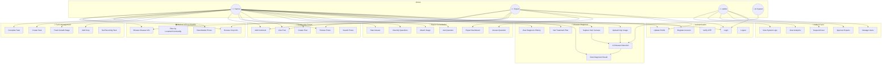

# Use Case Diagram

```mermaid
graph TB
    subgraph Actors
        F((👨‍🌾 Farmer))
        E((👨‍🔬 Expert))
        A((👨‍💼 Admin))
        AI((🤖 AI System))
    end
    
    subgraph "🔐 Authentication"
        UC_REG[Register Account]
        UC_LOGIN[Login]
        UC_OTP[Verify OTP]
        UC_PROFILE[Update Profile]
        UC_LOGOUT[Logout]
    end
    
    subgraph "🔬 Disease Diagnosis"
        UC_UPLOAD[Upload Crop Image]
        UC_CAPTURE[Capture from Camera]
        UC_DIAGNOSE[AI Disease Detection]
        UC_RESULT[View Diagnosis Result]
        UC_TREATMENT[Get Treatment Plan]
        UC_HISTORY[View Diagnosis History]
    end
    
    subgraph "💬 Expert Consultation"
        UC_ASK[Ask Question]
        UC_ATTACH[Attach Image]
        UC_VIEW_Q[View My Questions]
        UC_ANSWER[Answer Question]
        UC_RATE[Rate Answer]
        UC_EXPERT_DASH[Expert Dashboard]
    end
    
    subgraph "👥 Community Forum"
        UC_CREATE_POST[Create Post]
        UC_BROWSE[Browse Posts]
        UC_LIKE[Like Post]
        UC_COMMENT[Add Comment]
        UC_SEARCH[Search Posts]
    end
    
    subgraph "🌾 Farm Management"
        UC_ADD_CROP[Add Crop]
        UC_TRACK[Track Growth Stage]
        UC_CREATE_TASK[Create Task]
        UC_COMPLETE[Complete Task]
        UC_RECURRING[Set Recurring Task]
    end
    
    subgraph "📊 Market & Encyclopedia"
        UC_PRICES[View Market Prices]
        UC_FILTER[Filter by Location/Commodity]
        UC_CROPS_ENC[Browse Crop Info]
        UC_DISEASE_ENC[Browse Disease Info]
    end
    
    subgraph "🔧 Admin Panel"
        UC_MANAGE[Manage Users]
        UC_APPROVE[Approve Experts]
        UC_SUSPEND[Suspend User]
        UC_STATS[View Analytics]
        UC_LOGS[View System Logs]
    end
    
    %% Farmer connections
    F --> UC_REG
    F --> UC_LOGIN
    F --> UC_PROFILE
    F --> UC_UPLOAD
    F --> UC_CAPTURE
    F --> UC_RESULT
    F --> UC_TREATMENT
    F --> UC_HISTORY
    F --> UC_ASK
    F --> UC_ATTACH
    F --> UC_VIEW_Q
    F --> UC_RATE
    F --> UC_CREATE_POST
    F --> UC_BROWSE
    F --> UC_LIKE
    F --> UC_COMMENT
    F --> UC_ADD_CROP
    F --> UC_TRACK
    F --> UC_CREATE_TASK
    F --> UC_COMPLETE
    F --> UC_PRICES
    F --> UC_CROPS_ENC
    F --> UC_DISEASE_ENC
    
    %% Expert connections
    E --> UC_LOGIN
    E --> UC_PROFILE
    E --> UC_ANSWER
    E --> UC_EXPERT_DASH
    E --> UC_BROWSE
    E --> UC_LIKE
    E --> UC_COMMENT
    E --> UC_CROPS_ENC
    E --> UC_DISEASE_ENC
    
    %% Admin connections
    A --> UC_LOGIN
    A --> UC_MANAGE
    A --> UC_APPROVE
    A --> UC_SUSPEND
    A --> UC_STATS
    A --> UC_LOGS
    
    %% AI connections
    AI --> UC_DIAGNOSE
    UC_UPLOAD --> UC_DIAGNOSE
    UC_CAPTURE --> UC_DIAGNOSE
    UC_DIAGNOSE --> UC_RESULT
```
