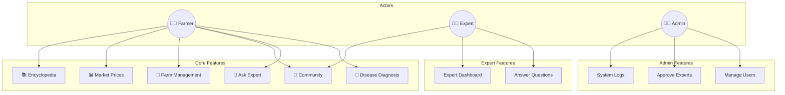

# Use Case Diagram

```mermaid
graph TB
    subgraph Actors
        F((👨‍🌾 Farmer))
        E((👨‍🔬 Expert))
        A((👨‍💼 Admin))
    end
    
    subgraph "Core Features"
        D[🔬 Disease Diagnosis]
        Q[💬 Ask Expert]
        C[👥 Community]
        FA[🌾 Farm Management]
        M[📊 Market Prices]
        EN[📚 Encyclopedia]
    end
    
    subgraph "Expert Features"
        ANS[Answer Questions]
        DASH[Expert Dashboard]
    end
    
    subgraph "Admin Features"
        USR[Manage Users]
        APP[Approve Experts]
        LOG[System Logs]
    end
    
    F --> D
    F --> Q
    F --> C
    F --> FA
    F --> M
    F --> EN
    
    E --> ANS
    E --> DASH
    E --> C
    
    A --> USR
    A --> APP
    A --> LOG
```
