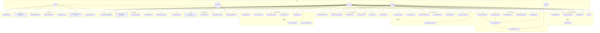

# Use Case Diagram

```mermaid
graph TB
    subgraph "Actors"
        F((👨‍🌾 Farmer))
        E((👨‍🔬 Expert))
        A((👨‍💼 Admin))
        AI((🤖 AI System))
        WA((🌤️ Weather API))
    end
    
    subgraph "Authentication & Profile"
        UC_REG[Register Account]
        UC_LOGIN[Login with Email/OTP]
        UC_PROFILE[Update Profile]
        UC_LOGOUT[Logout]
        UC_REFRESH[Refresh Token]
    end
    
    subgraph "Disease Diagnosis"
        UC_UPLOAD[Upload Crop Image]
        UC_CAPTURE[Capture from Camera]
        UC_PROCESS[AI Disease Detection]
        UC_RESULT[View Diagnosis Result]
        UC_TREATMENT[Get Treatment Plan]
        UC_HISTORY[View Diagnosis History]
        UC_SHARE[Share Diagnosis]
    end
    
    subgraph "Expert Consultation"
        UC_ASK[Ask Expert Question]
        UC_ATTACH_IMG[Attach Image to Question]
        UC_VIEW_Q[View My Questions]
        UC_ANSWER[Answer Farmer Question]
        UC_RATE[Rate Expert Answer]
        UC_EXPERT_DASH[Expert Dashboard]
        UC_EXPERT_STATS[View Answer Statistics]
    end
    
    subgraph "Community Forum"
        UC_CREATE_POST[Create Discussion Post]
        UC_BROWSE_POST[Browse Community Posts]
        UC_LIKE[Like/Unlike Post]
        UC_COMMENT[Comment on Post]
        UC_SEARCH_POST[Search Posts]
        UC_DELETE_POST[Delete Own Post]
    end
    
    subgraph "Farm Management"
        UC_ADD_CROP[Add Crop to Farm]
        UC_TRACK_GROWTH[Track Growth Stage]
        UC_UPDATE_PROGRESS[Update Crop Progress]
        UC_CREATE_TASK[Create Farm Task]
        UC_COMPLETE_TASK[Complete Task]
        UC_RECURRING_TASK[Set Recurring Tasks]
        UC_TASK_REMINDER[Receive Task Reminders]
    end
    
    subgraph "Market & Weather"
        UC_PRICES[View Market Prices]
        UC_FILTER_MARKET[Filter by Commodity/Location]
        UC_PRICE_TRENDS[View Price Trends]
        UC_WEATHER[View Weather Forecast]
        UC_ALERTS[Receive Weather Alerts]
    end
    
    subgraph "Encyclopedia"
        UC_BROWSE_CROPS[Browse Crop Encyclopedia]
        UC_BROWSE_DISEASE[Browse Disease Encyclopedia]
        UC_SEARCH_ENC[Search Encyclopedia]
        UC_CROP_DETAIL[View Crop Details]
        UC_DISEASE_DETAIL[View Disease Treatment]
    end
    
    subgraph "Admin Panel"
        UC_MANAGE_USERS[Manage All Users]
        UC_APPROVE_EXPERT[Approve Expert Registration]
        UC_SUSPEND[Suspend/Activate User]
        UC_ANALYTICS[View System Analytics]
        UC_LOGS[View System Logs]
        UC_MANAGE_CONTENT[Manage Encyclopedia Content]
        UC_MARKET_UPDATE[Update Market Prices]
    end
    
    %% Farmer Use Cases
    F --> UC_REG
    F --> UC_LOGIN
    F --> UC_PROFILE
    F --> UC_LOGOUT
    F --> UC_UPLOAD
    F --> UC_CAPTURE
    F --> UC_RESULT
    F --> UC_TREATMENT
    F --> UC_HISTORY
    F --> UC_SHARE
    F --> UC_ASK
    F --> UC_ATTACH_IMG
    F --> UC_VIEW_Q
    F --> UC_RATE
    F --> UC_CREATE_POST
    F --> UC_BROWSE_POST
    F --> UC_LIKE
    F --> UC_COMMENT
    F --> UC_SEARCH_POST
    F --> UC_DELETE_POST
    F --> UC_ADD_CROP
    F --> UC_TRACK_GROWTH
    F --> UC_UPDATE_PROGRESS
    F --> UC_CREATE_TASK
    F --> UC_COMPLETE_TASK
    F --> UC_RECURRING_TASK
    F --> UC_PRICES
    F --> UC_FILTER_MARKET
    F --> UC_PRICE_TRENDS
    F --> UC_WEATHER
    F --> UC_ALERTS
    F --> UC_BROWSE_CROPS
    F --> UC_BROWSE_DISEASE
    F --> UC_SEARCH_ENC
    F --> UC_CROP_DETAIL
    F --> UC_DISEASE_DETAIL
    
    %% Expert Use Cases
    E --> UC_LOGIN
    E --> UC_PROFILE
    E --> UC_ANSWER
    E --> UC_EXPERT_DASH
    E --> UC_EXPERT_STATS
    E --> UC_BROWSE_POST
    E --> UC_LIKE
    E --> UC_COMMENT
    E --> UC_BROWSE_CROPS
    E --> UC_BROWSE_DISEASE
    
    %% Admin Use Cases
    A --> UC_LOGIN
    A --> UC_MANAGE_USERS
    A --> UC_APPROVE_EXPERT
    A --> UC_SUSPEND
    A --> UC_ANALYTICS
    A --> UC_LOGS
    A --> UC_MANAGE_CONTENT
    A --> UC_MARKET_UPDATE
    
    %% System Actors
    AI --> UC_PROCESS
    UC_UPLOAD --> UC_PROCESS
    UC_CAPTURE --> UC_PROCESS
    UC_PROCESS --> UC_RESULT
    
    WA --> UC_WEATHER
    WA --> UC_ALERTS
    
    %% Include/Extend relationships
    UC_LOGIN -.->|includes| UC_REFRESH
    UC_ASK -.->|extends| UC_ATTACH_IMG
    UC_CREATE_TASK -.->|extends| UC_RECURRING_TASK
```
