# Use Case Diagram

```mermaid
graph TB
    subgraph Actors
        F((👨‍🌾 Farmer))
        E((👨‍🔬 Expert))
        A((👨‍💼 Admin))
    end
    
    subgraph "Core Features"
        D[🔬 Disease Diagnosis]
        Q[💬 Ask Expert]
        C[👥 Community]
        FA[🌾 Farm Management]
        M[📊 Market Prices]
        EN[📚 Encyclopedia]
        R[⭐ Rate Answers]
    end
    
    subgraph "Expert Features"
        ANS[Answer Questions]
        DASH[Expert Dashboard]
        KB[📖 Knowledge Base]
        STATS[View My Stats]
    end
    
    subgraph "Admin Features"
        USR[Manage Users]
        APP[Approve Experts]
        LOG[System Logs]
        AGRO[🧪 Agronomy Rules]
        METRICS[📈 System Metrics]
        ENCYC[📝 Encyclopedia CRUD]
    end
    
    F --> D
    F --> Q
    F --> C
    F --> FA
    F --> M
    F --> EN
    F --> R
    
    E --> ANS
    E --> DASH
    E --> KB
    E --> STATS
    E --> C
    
    A --> USR
    A --> APP
    A --> LOG
    A --> AGRO
    A --> METRICS
    A --> ENCYC
```

## Use Case Descriptions

### Farmer Use Cases
| Use Case | Description |
|----------|-------------|
| Disease Diagnosis | Upload crop image for AI-powered disease detection with treatment recommendations |
| Ask Expert | Submit questions to agricultural experts with optional image attachments |
| Community | Browse, create posts, like and comment on community discussions |
| Farm Management | Track crops, manage tasks, monitor growth stages |
| Market Prices | View current commodity prices and trends by location |
| Encyclopedia | Browse crop and disease information library |
| Rate Answers | Rate expert answers and AI diagnoses (1-5 stars) |

### Expert Use Cases
| Use Case | Description |
|----------|-------------|
| Answer Questions | View and respond to farmer questions |
| Expert Dashboard | View personal stats, answered questions, ratings |
| Knowledge Base | CRUD operations on diagnostic rules, treatment constraints, seasonal patterns |
| View My Stats | Track answer count, average rating, expertise areas |

### Admin Use Cases
| Use Case | Description |
|----------|-------------|
| Manage Users | View, suspend, activate user accounts |
| Approve Experts | Review and approve expert registrations |
| System Logs | Monitor application logs and errors |
| Agronomy Rules | Full CRUD on all agronomy intelligence data |
| System Metrics | View daily stats, diagnoses count, user activity |
| Encyclopedia CRUD | Add, edit, delete crops and diseases |

