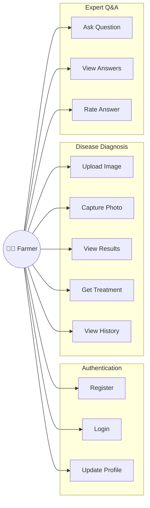
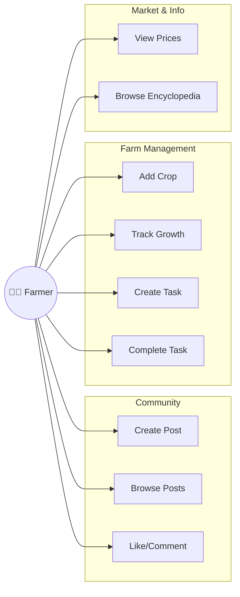
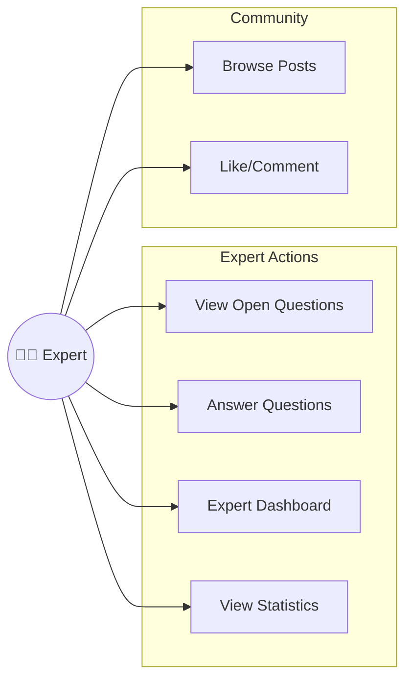
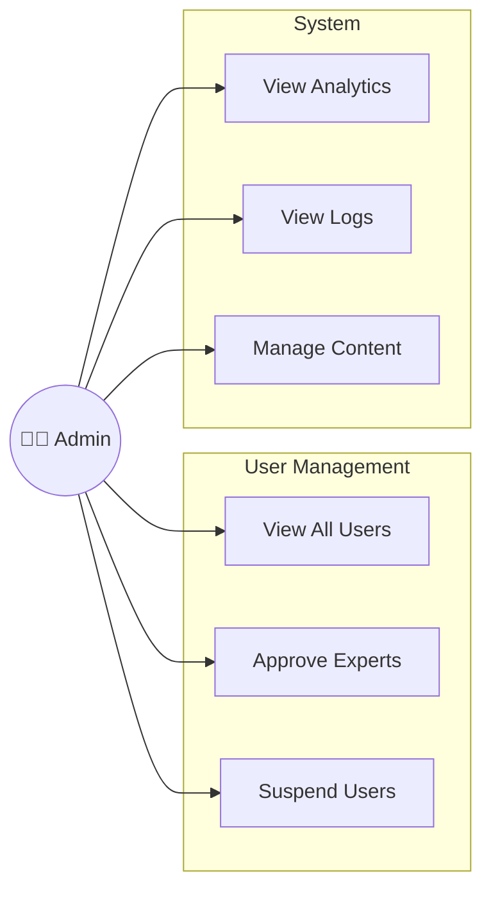
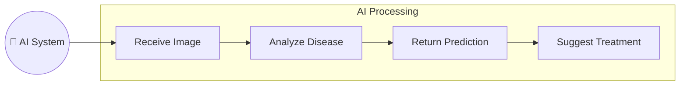

# Use Case Diagram

## Farmer Use Cases

```mermaid
graph LR
    F((👨‍🌾 Farmer))
    
    subgraph Authentication
        UC1[Register]
        UC2[Login]
        UC3[Update Profile]
    end
    
    subgraph "Disease Diagnosis"
        UC4[Upload Image]
        UC5[Capture Photo]
        UC6[View Results]
        UC7[Get Treatment]
        UC8[View History]
    end
    
    subgraph "Expert Q&A"
        UC9[Ask Question]
        UC10[View Answers]
        UC11[Rate Answer]
    end
    
    F --> UC1
    F --> UC2
    F --> UC3
    F --> UC4
    F --> UC5
    F --> UC6
    F --> UC7
    F --> UC8
    F --> UC9
    F --> UC10
    F --> UC11
```

## Farmer Additional Features

```mermaid
graph LR
    F((👨‍🌾 Farmer))
    
    subgraph Community
        UC12[Create Post]
        UC13[Browse Posts]
        UC14[Like/Comment]
    end
    
    subgraph "Farm Management"
        UC15[Add Crop]
        UC16[Track Growth]
        UC17[Create Task]
        UC18[Complete Task]
    end
    
    subgraph "Market & Info"
        UC19[View Prices]
        UC20[Browse Encyclopedia]
    end
    
    F --> UC12
    F --> UC13
    F --> UC14
    F --> UC15
    F --> UC16
    F --> UC17
    F --> UC18
    F --> UC19
    F --> UC20
```

## Expert Use Cases

```mermaid
graph LR
    E((👨‍🔬 Expert))
    
    subgraph "Expert Actions"
        UC21[View Open Questions]
        UC22[Answer Questions]
        UC23[Expert Dashboard]
        UC24[View Statistics]
    end
    
    subgraph "Community"
        UC25[Browse Posts]
        UC26[Like/Comment]
    end
    
    E --> UC21
    E --> UC22
    E --> UC23
    E --> UC24
    E --> UC25
    E --> UC26
```

## Admin Use Cases

```mermaid
graph LR
    A((👨‍💼 Admin))
    
    subgraph "User Management"
        UC27[View All Users]
        UC28[Approve Experts]
        UC29[Suspend Users]
    end
    
    subgraph "System"
        UC30[View Analytics]
        UC31[View Logs]
        UC32[Manage Content]
    end
    
    A --> UC27
    A --> UC28
    A --> UC29
    A --> UC30
    A --> UC31
    A --> UC32
```

## AI System

```mermaid
graph LR
    AI((🤖 AI System))
    
    subgraph "AI Processing"
        UC33[Receive Image]
        UC34[Analyze Disease]
        UC35[Return Prediction]
        UC36[Suggest Treatment]
    end
    
    AI --> UC33
    UC33 --> UC34
    UC34 --> UC35
    UC35 --> UC36
```
